# ISO-42001-Visual-Library

[](https://creativecommons.org/licenses/by/4.0/)


A collection of professional and humorous infographic cards to help you understand, remember, and explain **ISO/IEC 42001.**

> [!NOTE]
> ### 🔓 Project Access & Status
> **Free to use, share, or remix these cards in presentations, training, and awareness sessions.**
> 
> No gatekeeping — attribution is appreciated but not required.
> 
> *Status: Work in progress. Current coverage includes Clauses 4–10, Annex A domain and control cards, and the Audit Readiness mini-deck.*

<details>
  <summary><b>Click to expand Table of Contents</b></summary>
  <br>

  - [What this repository is](#what-this-repository-is)
  - [Clause Memory Cards](#clause-memory-cards)
  - [Annex A Domain Cards](#annex-a-domain-cards)
  - [Annex A Control Cards](#annex-a-control-cards)
  - [Audit Readiness Cards](#audit-readiness-cards)
  - [How to use it](#how-to-use-it)
</details>

## What this repository is

This repository is a practical visual library for learning and explaining ISO/IEC 42001:2023, the international standard for AI Management Systems (AIMS).

It is designed to make ISO 42001 easier to understand, remember, and explain through visual learning. The library combines professional and humorous infographic cards to support study, awareness, training, presentations, and audit preparation.

## Why this exists

ISO 42001 is important, but most available material is either very dense, overly generic, or aimed at people who already understand management system standards.

This project fills that gap by turning the standard into clear, reusable learning assets. The goal is to help people build confidence with AI governance concepts without losing accuracy or inventing requirements.

## How the library works

Each topic can have up to four matching assets:

| Layer | Purpose | Best used for |
|---|---|---|
| Reference card | Neutral source facts and reusable explanations | Learning, checking details, creating new cards |
| Professional infographic | Polished business-ready visual summary | Briefings, audit preparation, stakeholder sharing |
| Funny infographic | Humorous visual memory aid | Learning reinforcement and making the topic stick |
| Professional simple memory card | Clean minimal visual summary for clause recall | Quick reference and professional sharing |
| Funny simple memory card | One strong visual hook for clause recall | Remembering clause number and keyword |

The simple memory cards are deliberately minimal. They are designed to help people remember the clause number and core keyword quickly.

The reference card is the canonical content source. The professional and funny infographics are two different treatments of the same topic: one for clear explanation and sharing, the other for memory and engagement. The funny cards use a different style, but they should not introduce different requirements or change the meaning of the standard.

## Current coverage

The library currently covers the ISO 42001 overview, Annex A overview, domain cards, control cards, Clauses 4 to 10, and the Audit Readiness mini-deck.

For Audit Readiness reference material, see the [Audit Readiness reference index](cards/audit/reference/README.md).

## Planned additions

- Expanded Annex A guidance and supporting visuals
- AI principles
- Certification preparation
- People impact and human oversight
- ISO 42001 and ISO 27001 comparison
- EU AI Act alignment
- AI policy templates

## How to Use This Library

These assets are learning aids designed for quick recall, communication, and awareness; they are not a replacement for the full ISO/IEC 42001:2023 standard.

Project structure and naming conventions are documented in [CONTEXT.md](CONTEXT.md).

## Card gallery

> [!TIP]
> Click any card to open a full-size view. This is the easiest way to read the detail.

### Overview

<p align="center">
  
</p>

---

<p align="center">
  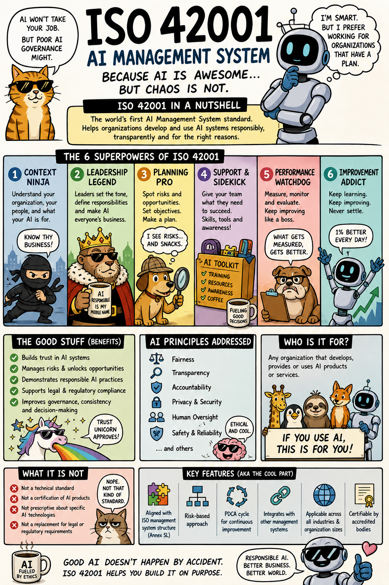
</p>

### Clause memory cards

The simple memory cards are designed for quick recall. Each card reduces one clause to its core keyword. The professional simple cards use a clean minimal style. The funny simple cards use a strong visual hook.

These cards are intentionally simple. The goal is not to explain every sub-clause, but to make the main association easy to remember.

#### Professional simple memory cards

| Clause 4 | Clause 5 | Clause 6 |
|:---:|:---:|:---:|
|  |  |  |
| **Clause 7** | **Clause 8** | **Clause 9** |
|  |  |  |
|  | **Clause 10** |  |
|  |  |  |

#### Funny simple memory cards

| Clause 4 | Clause 5 | Clause 6 |
|:---:|:---:|:---:|
| 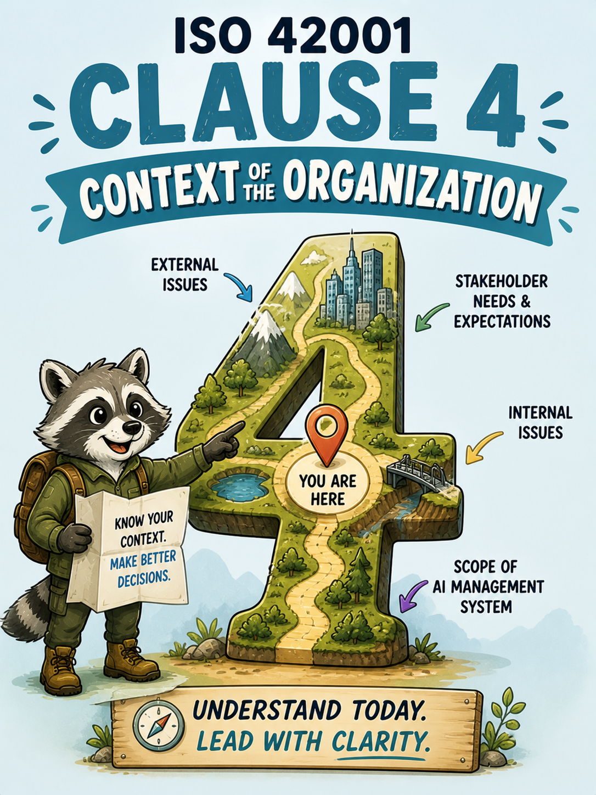 |  | 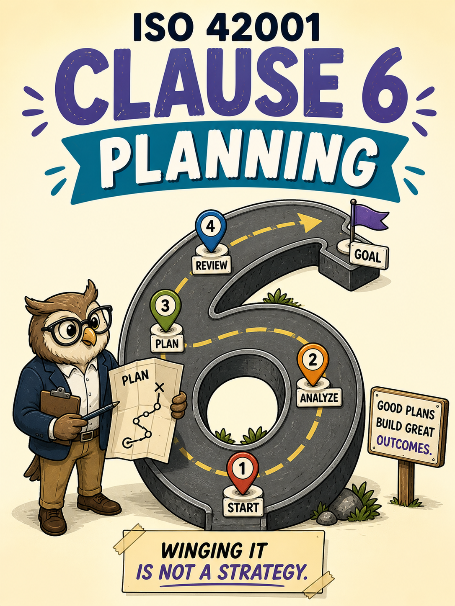 |
| **Clause 7** | **Clause 8** | **Clause 9** |
| 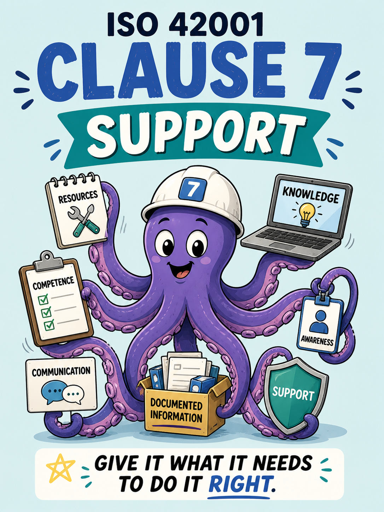 | 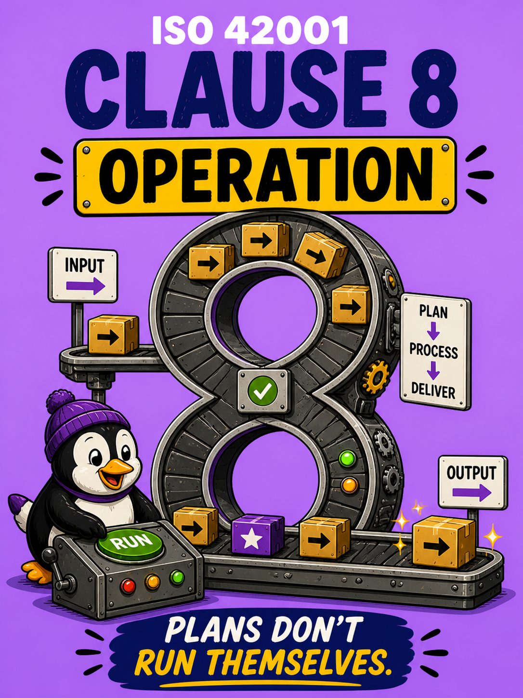 | 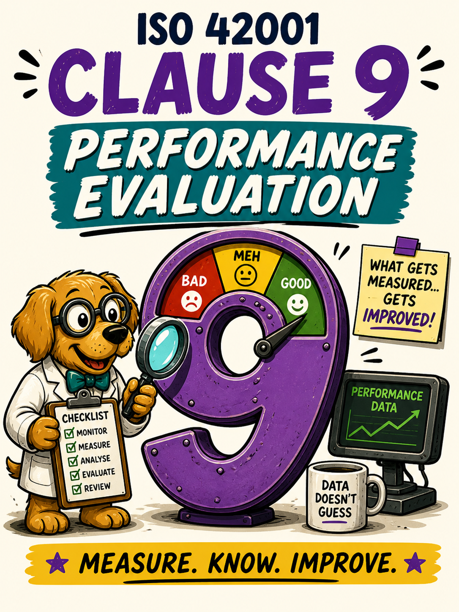 |
|  | **Clause 10** |  |
|  | 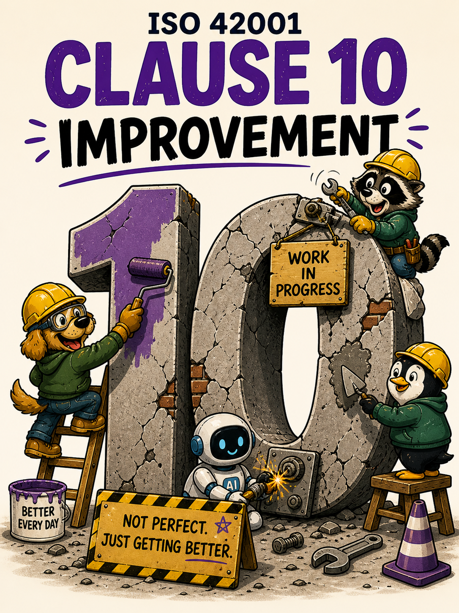 |  |

### Clause cards

Clauses 4–10 are the mandatory requirements of ISO 42001 — the core of the standard that every organisation must implement. Unlike Annex A (which provides controls to select from), these clauses are non-negotiable. Each clause builds on the previous one, forming a management system cycle.

<table>
  <thead>
    <tr>
      <th width="16%">Topic</th>
      <th width="42%">Professional</th>
      <th width="42%">Funny</th>
    </tr>
  </thead>
  <tbody>
    <tr>
      <td width="16%"><strong>Clause 4</strong><br>Context of the Organisation<br><a href="cards/reference/clause-04-context-of-the-organisation.md">Reference ↗</a></td>
      <td width="42%">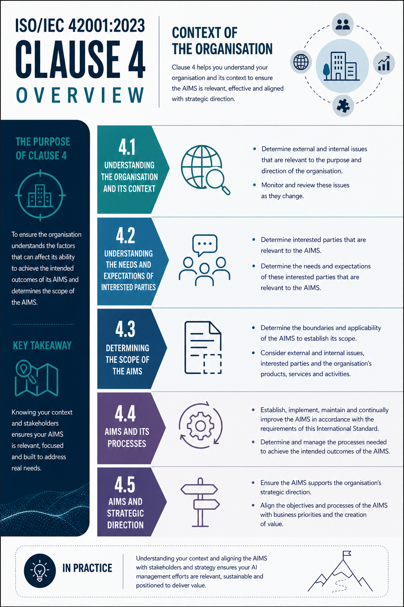</td>
      <td width="42%"></td>
    </tr>
    <tr>
      <td width="16%"><strong>Clause 5</strong><br>Leadership<br><a href="cards/reference/clause-05-leadership.md">Reference ↗</a></td>
      <td width="42%"></td>
      <td width="42%">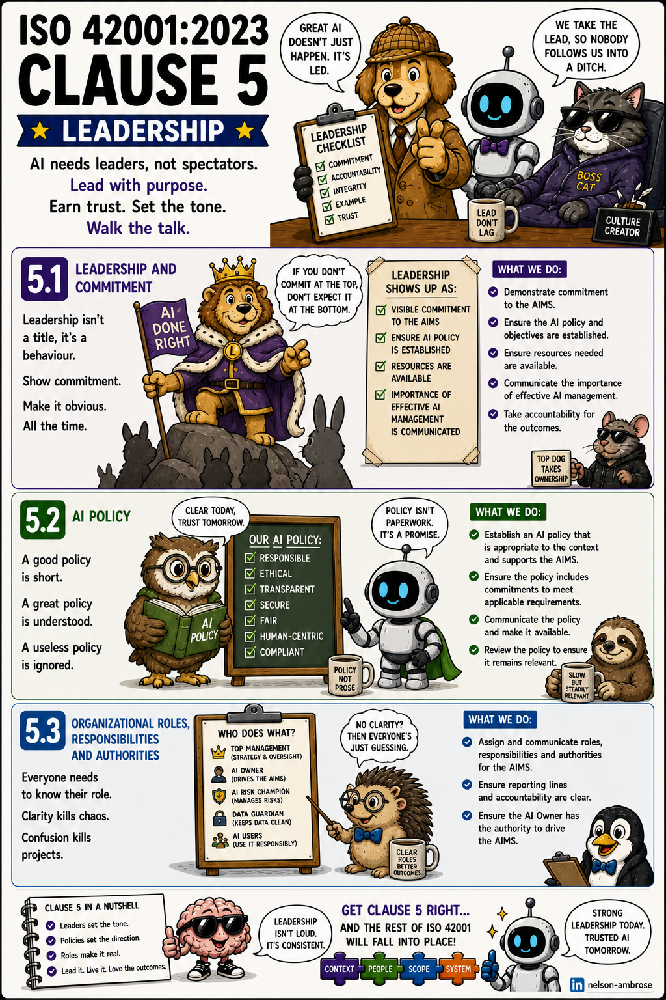</td>
    </tr>
    <tr>
      <td width="16%"><strong>Clause 6</strong><br>Planning<br><a href="cards/reference/clause-06-planning.md">Reference ↗</a></td>
      <td width="42%">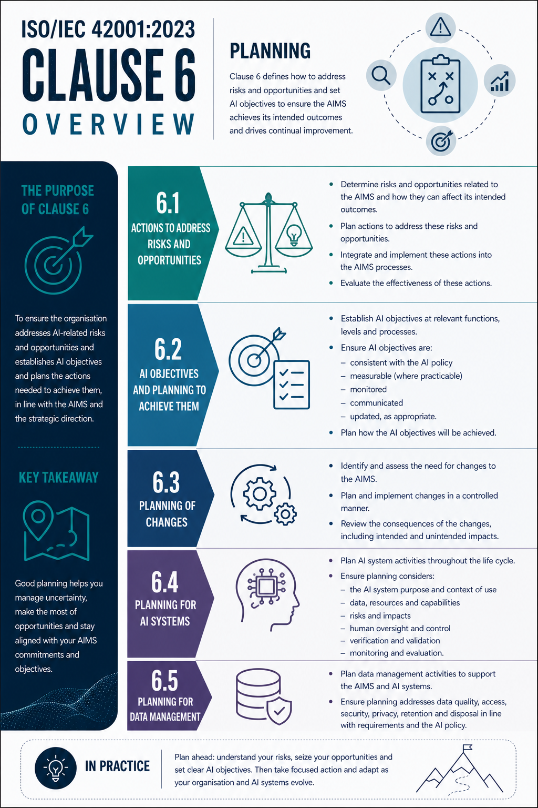</td>
      <td width="42%">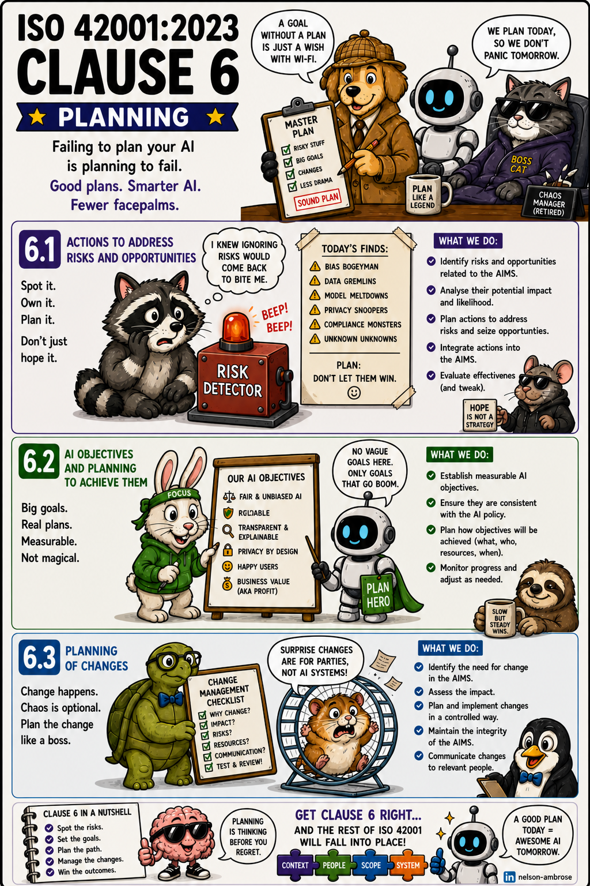</td>
    </tr>
    <tr>
      <td width="16%"><strong>Clause 7</strong><br>Support<br><a href="cards/reference/clause-07-support.md">Reference ↗</a></td>
      <td width="42%"></td>
      <td width="42%">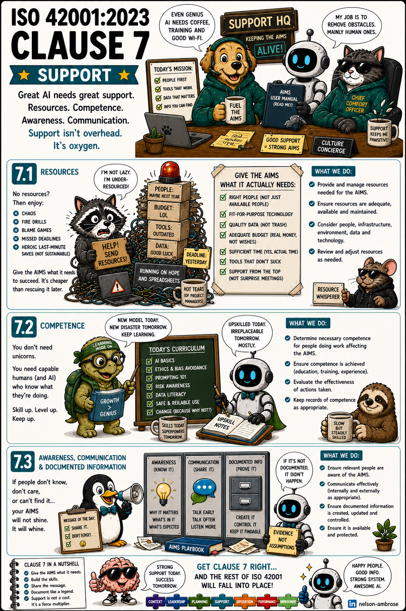</td>
    </tr>
    <tr>
      <td width="16%"><strong>Clause 8</strong><br>Operation<br><a href="cards/reference/clause-08-operation.md">Reference ↗</a></td>
      <td width="42%"></td>
      <td width="42%"></td>
    </tr>
    <tr>
      <td width="16%"><strong>Clause 9</strong><br>Performance Evaluation<br><a href="cards/reference/clause-09-performance-evaluation.md">Reference ↗</a></td>
      <td width="42%"></td>
      <td width="42%"></td>
    </tr>
    <tr>
      <td width="16%"><strong>Clause 10</strong><br>Improvement<br><a href="cards/reference/clause-10-improvement.md">Reference ↗</a></td>
      <td width="42%">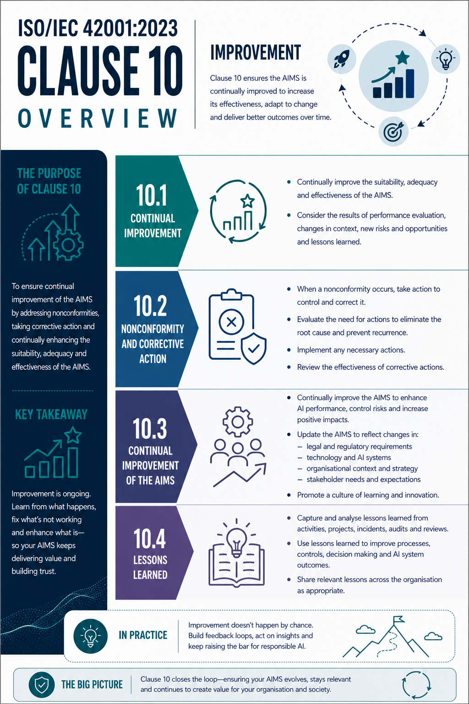</td>
      <td width="42%"></td>
    </tr>
  </tbody>
</table>

Annex A is the operational core of ISO 42001. It contains controls across nine areas (A.2–A.10) that define what responsible AI management looks like in practice.

### Annex A domain cards

These controls are grouped into four domains:

- **Governance** — Establishing AI policies, leadership accountability, and the overall direction for responsible AI within the organisation.
- **Organisation** — Defining internal roles and responsibilities, ensuring the right people, skills, and resources are in place to manage AI effectively.
- **Operation** — Managing the full AI system lifecycle: from design and data management through deployment, monitoring, and decommissioning.
- **Relationships** — Governing how the organisation works with third parties, customers, and other stakeholders who develop, supply, or are affected by AI systems.

<table>
  <thead>
    <tr>
      <th width="50%">Professional</th>
      <th width="50%">Funny</th>
    </tr>
  </thead>
  <tbody>
    <tr>
      <td width="50%"></td>
      <td width="50%"></td>
    </tr>
  </tbody>
</table>

The overview images show how Annex A is grouped. The table below compares the professional and funny versions of each Annex A domain card.

<table>
  <thead>
    <tr>
      <th width="16%">Domain</th>
      <th width="42%">Professional</th>
      <th width="42%">Funny</th>
    </tr>
  </thead>
  <tbody>
    <tr>
      <td width="16%">Governance<br><a href="cards/annex-a/reference/domain/governance.md">Reference ↗</a></td>
      <td width="42%">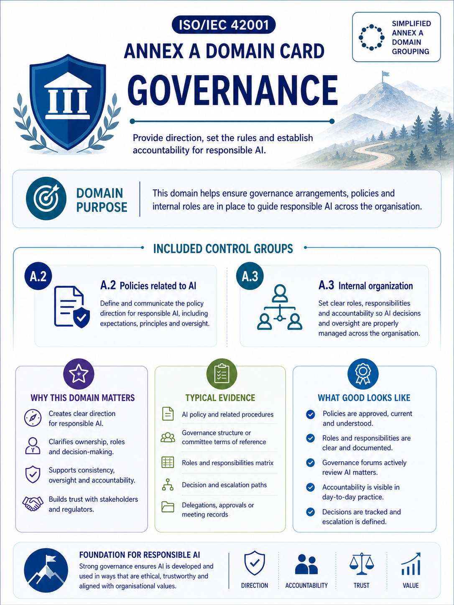</td>
      <td width="42%">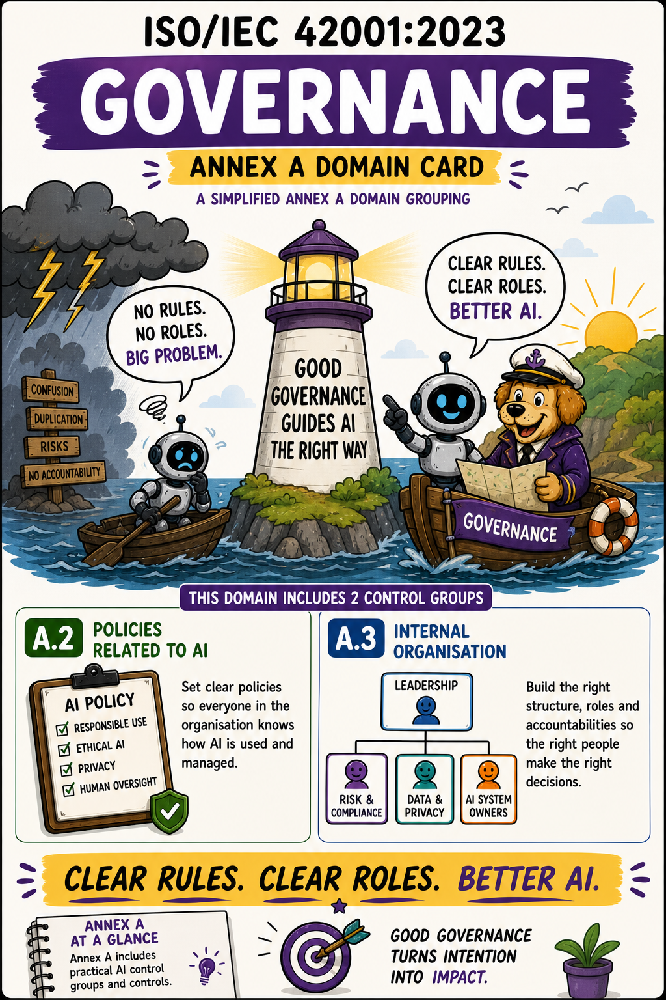</td>
    </tr>
    <tr>
      <td width="16%">Organisation<br><a href="cards/annex-a/reference/domain/organisation.md">Reference ↗</a></td>
      <td width="42%">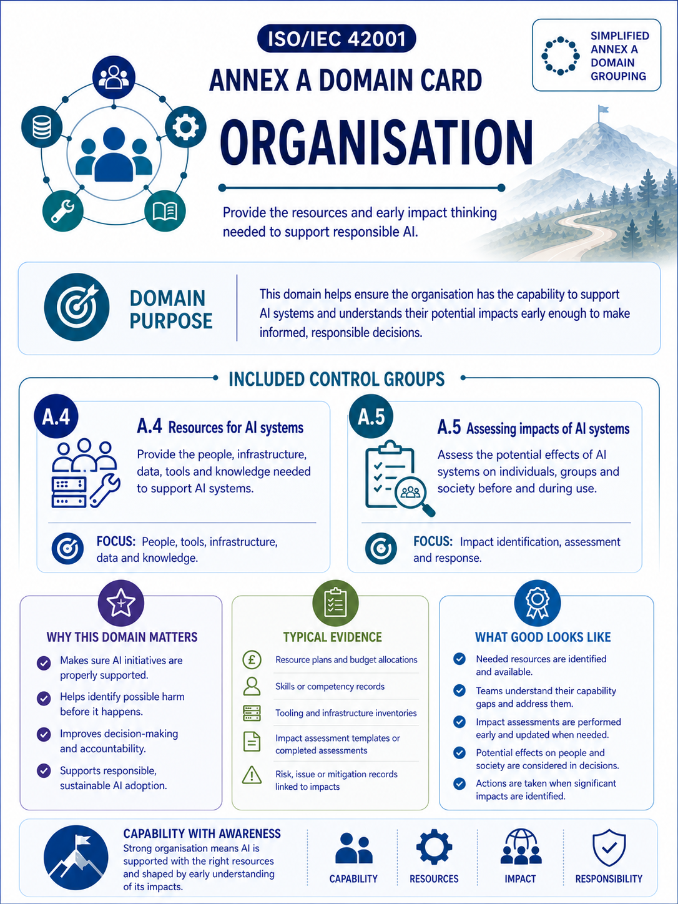</td>
      <td width="42%">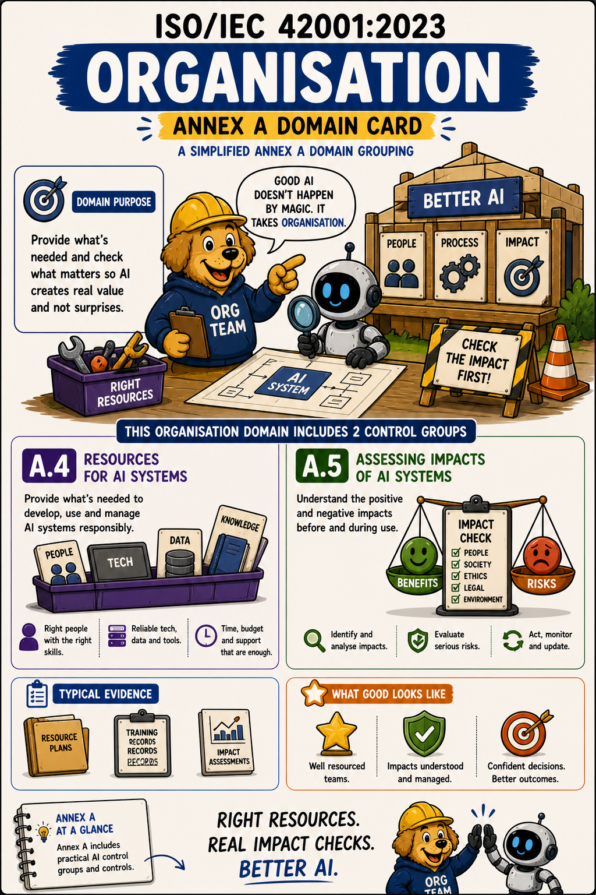</td>
    </tr>
    <tr>
      <td width="16%">Operation<br><a href="cards/annex-a/reference/domain/operation.md">Reference ↗</a></td>
      <td width="42%">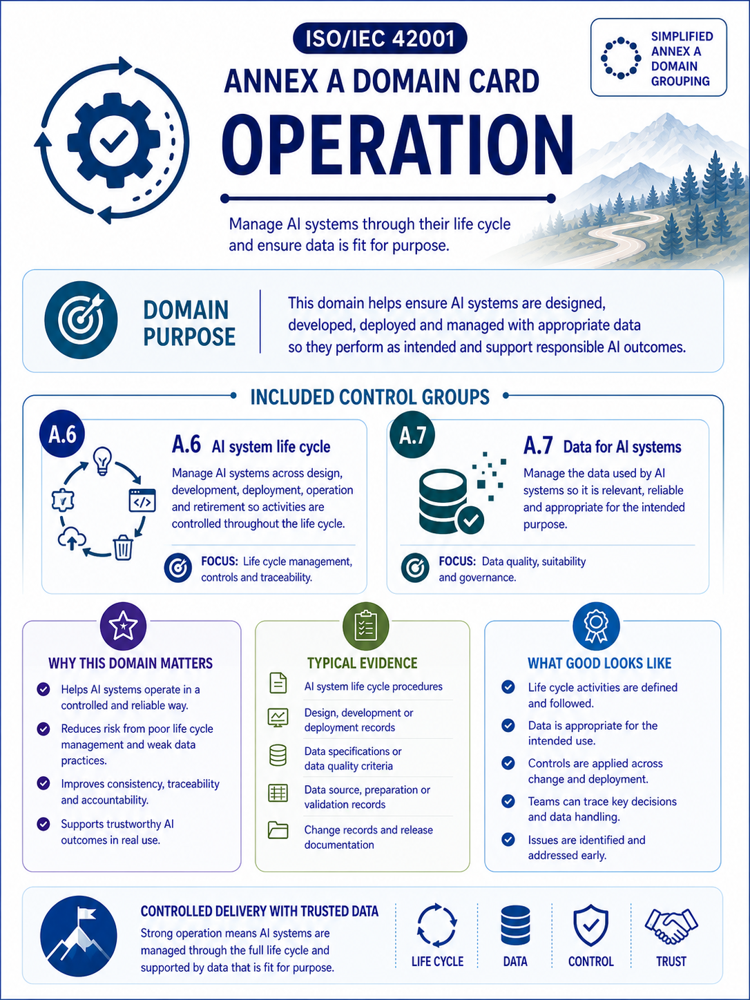</td>
      <td width="42%">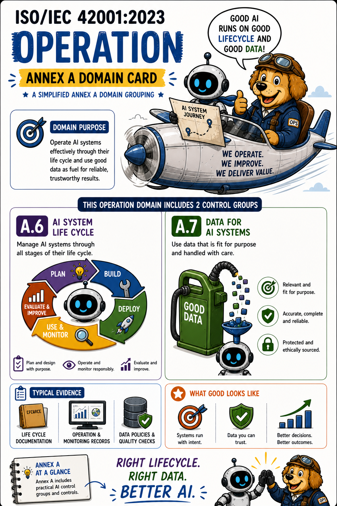</td>
    </tr>
    <tr>
      <td width="16%">Relationships<br><a href="cards/annex-a/reference/domain/relationships.md">Reference ↗</a></td>
      <td width="42%">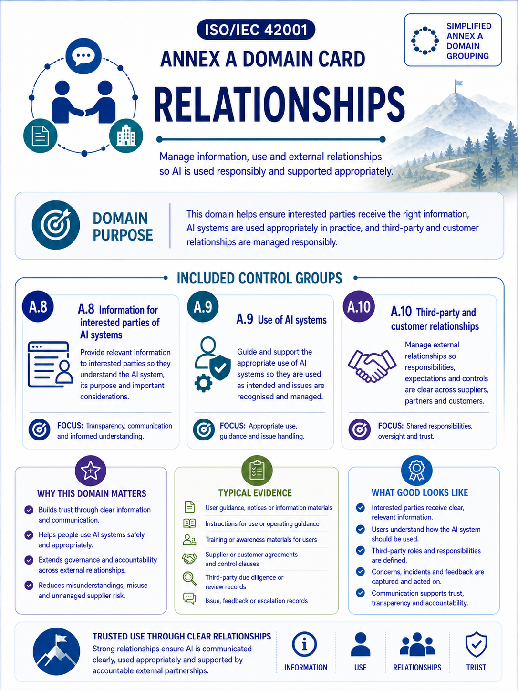</td>
      <td width="42%">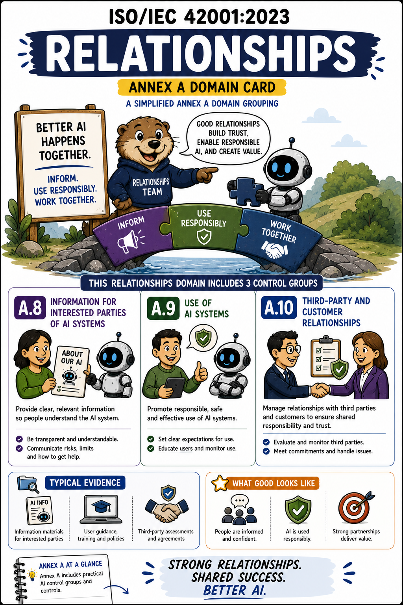</td>
    </tr>
  </tbody>
</table>

### Annex A Control Cards

These cards provide individual control-level learning summaries for Annex A. Each control is available in a professional version and a funny version.

<table>
  <thead>
    <tr>
      <th width="16%">Control</th>
      <th width="42%">Professional</th>
      <th width="42%">Funny</th>
    </tr>
  </thead>
  <tbody>
    <tr>
      <td width="16%"><strong>A.2</strong> Policies Related to AI<br><a href="cards/annex-a/reference/control/a-02-policies-related-to-ai.md">Reference ↗</a></td>
      <td width="42%"></td>
      <td width="42%"></td>
    </tr>
    <tr>
      <td width="16%"><strong>A.3</strong> Internal Organisation<br><a href="cards/annex-a/reference/control/a-03-internal-organisation.md">Reference ↗</a></td>
      <td width="42%">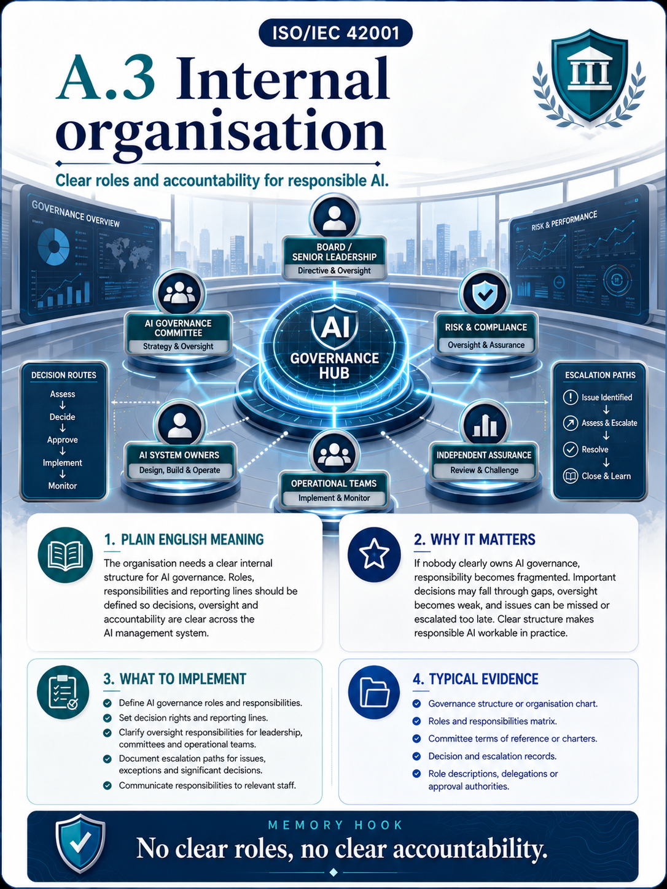</td>
      <td width="42%"></td>
    </tr>
    <tr>
      <td width="16%"><strong>A.4</strong> Resources for AI Systems<br><a href="cards/annex-a/reference/control/a-04-resources-for-ai-systems.md">Reference ↗</a></td>
      <td width="42%">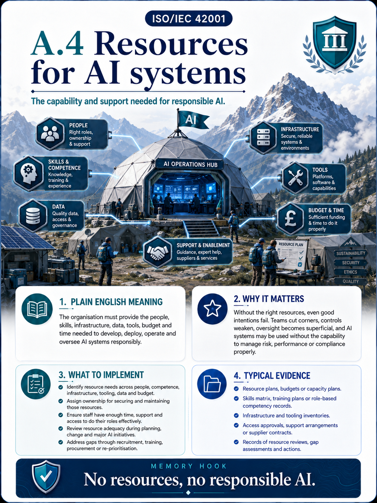</td>
      <td width="42%"></td>
    </tr>
    <tr>
      <td width="16%"><strong>A.5</strong> Assessing Impacts of AI Systems<br><a href="cards/annex-a/reference/control/a-05-assessing-impacts-of-ai-systems.md">Reference ↗</a></td>
      <td width="42%"></td>
      <td width="42%">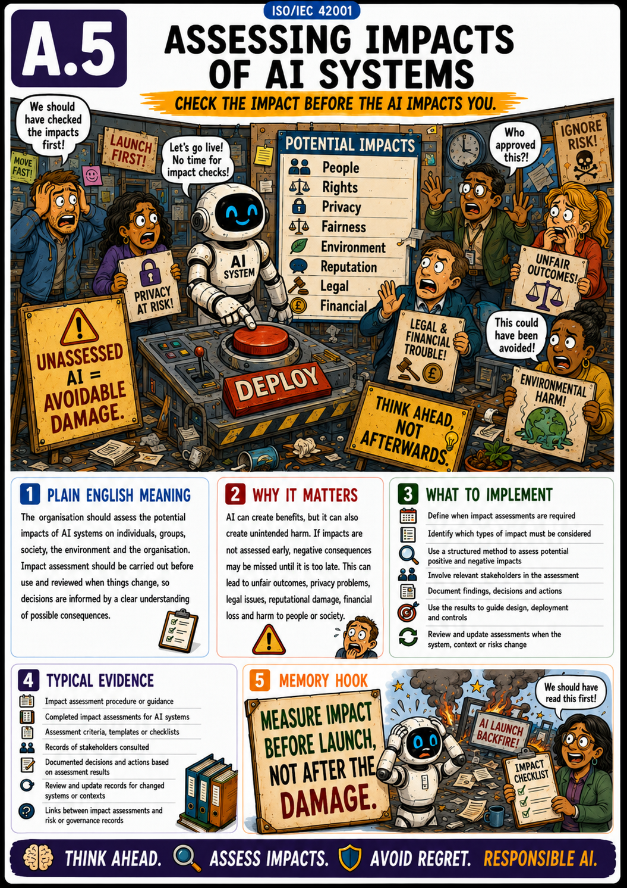</td>
    </tr>
    <tr>
      <td width="16%"><strong>A.6</strong> AI System Life Cycle<br><a href="cards/annex-a/reference/control/a-06-ai-system-life-cycle.md">Reference ↗</a></td>
      <td width="42%">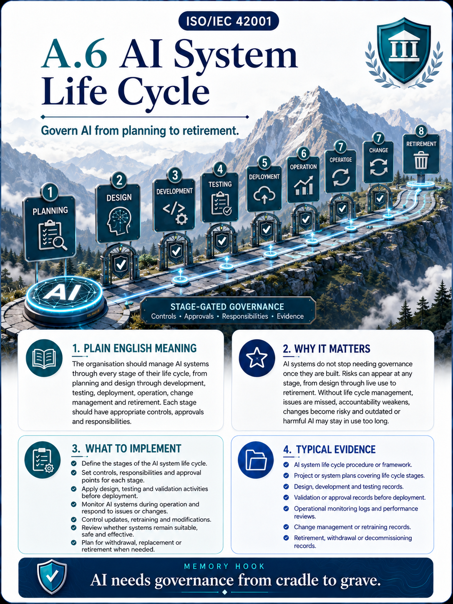</td>
      <td width="42%"></td>
    </tr>
    <tr>
      <td width="16%"><strong>A.7</strong> Data for AI Systems<br><a href="cards/annex-a/reference/control/a-07-data-for-ai-systems.md">Reference ↗</a></td>
      <td width="42%"></td>
      <td width="42%"></td>
    </tr>
    <tr>
      <td width="16%"><strong>A.8</strong> Information for Interested Parties<br><a href="cards/annex-a/reference/control/a-08-information-for-interested-parties.md">Reference ↗</a></td>
      <td width="42%">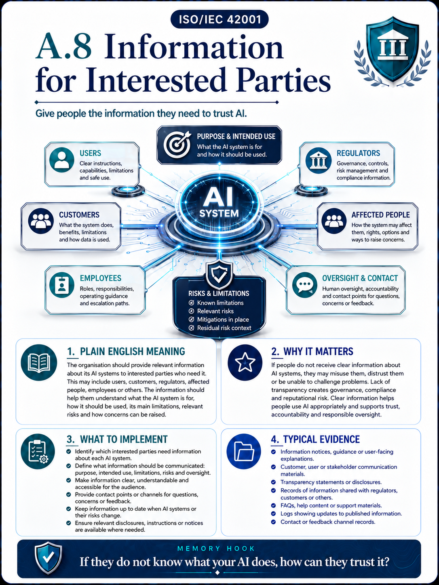</td>
      <td width="42%"></td>
    </tr>
    <tr>
      <td width="16%"><strong>A.9</strong> Use of AI Systems<br><a href="cards/annex-a/reference/control/a-09-use-of-ai-systems.md">Reference ↗</a></td>
      <td width="42%"></td>
      <td width="42%">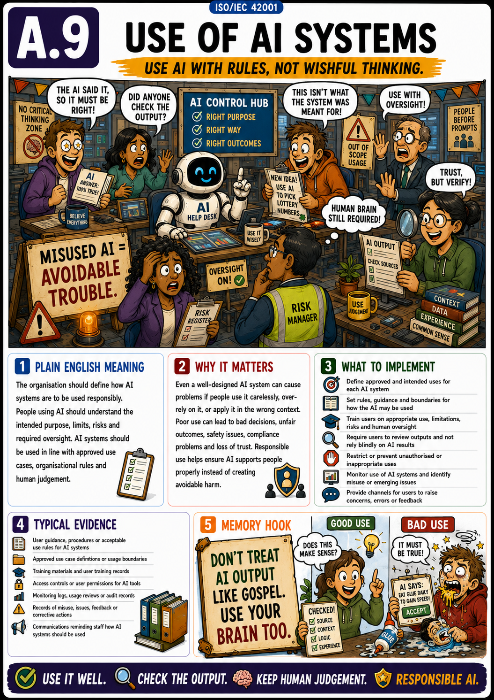</td>
    </tr>
    <tr>
      <td width="16%"><strong>A.10</strong> Third-party and Customer Relationships<br><a href="cards/annex-a/reference/control/a-10-third-party-and-customer-relationships.md">Reference ↗</a></td>
      <td width="42%"></td>
      <td width="42%"></td>
    </tr>
  </tbody>
</table>

## Audit Readiness Cards

These five cards help you prepare for ISO 42001 audits. They cover what auditors actually look for, the difference between strong and weak evidence, common failure patterns across Annex A, and how to talk about controls confidently.

Reference files and both professional and funny visual versions are available for all five cards. See the [Audit Readiness reference index](cards/audit/reference/README.md) for an overview.

<table>
  <thead>
    <tr>
      <th width="16%">Card</th>
      <th width="42%">Professional</th>
      <th width="42%">Funny</th>
    </tr>
  </thead>
  <tbody>
    <tr>
      <td width="16%"><strong>Audit-01</strong><br>What an Auditor Actually Looks For<br><a href="cards/audit/reference/audit-01-what-an-auditor-actually-looks-for.md">Reference ↗</a></td>
      <td width="42%"></td>
      <td width="42%">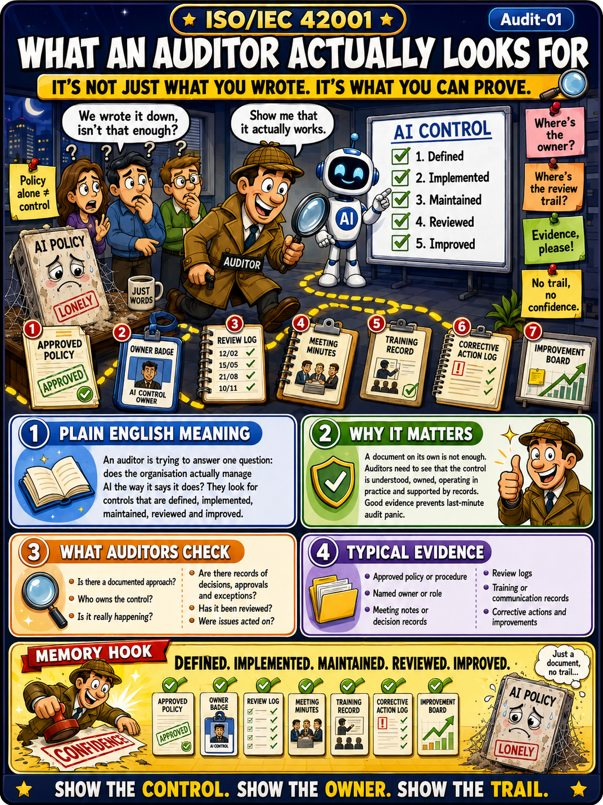</td>
    </tr>
    <tr>
      <td width="16%"><strong>Audit-02</strong><br>Evidence vs Good Intentions<br><a href="cards/audit/reference/audit-02-evidence-vs-good-intentions.md">Reference ↗</a></td>
      <td width="42%">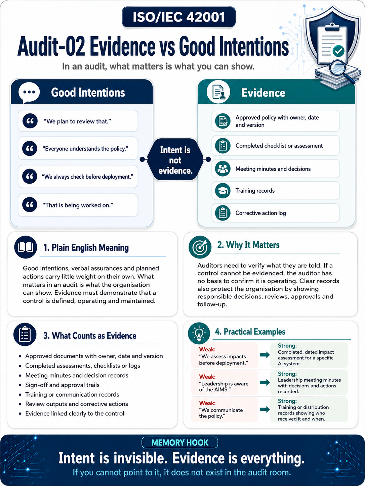</td>
      <td width="42%">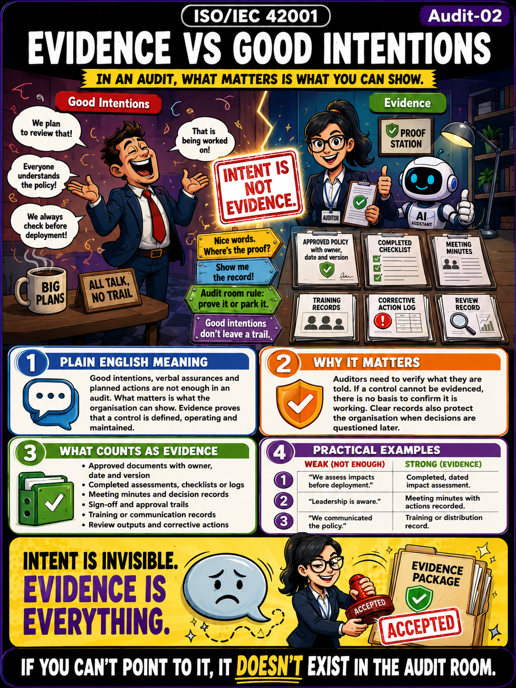</td>
    </tr>
    <tr>
      <td width="16%"><strong>Audit-03</strong><br>Strong Versus Weak Evidence Examples<br><a href="cards/audit/reference/audit-03-strong-versus-weak-evidence-examples.md">Reference ↗</a></td>
      <td width="42%">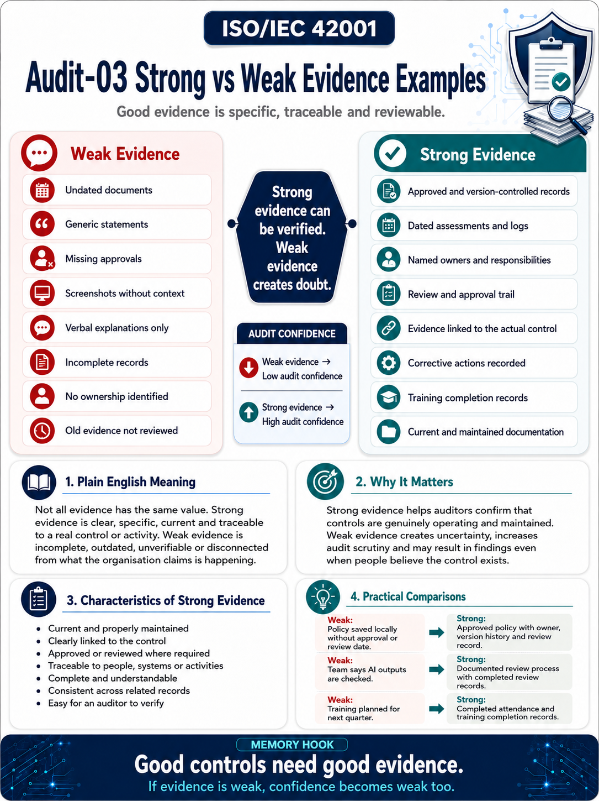</td>
      <td width="42%"></td>
    </tr>
    <tr>
      <td width="16%"><strong>Audit-04</strong><br>Common Audit Failure Modes Across Annex A<br><a href="cards/audit/reference/audit-04-common-audit-failure-modes-across-annex-a.md">Reference ↗</a></td>
      <td width="42%">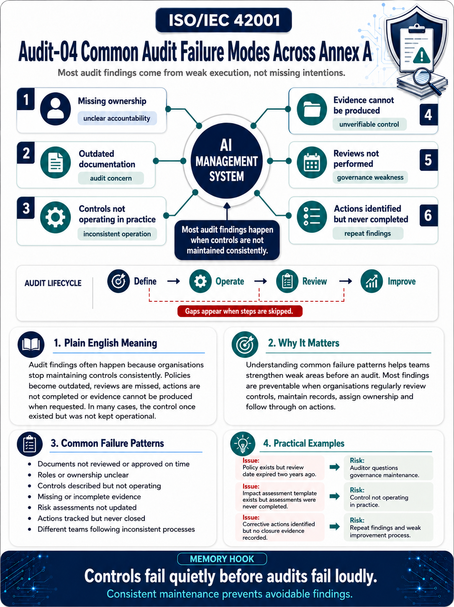</td>
      <td width="42%">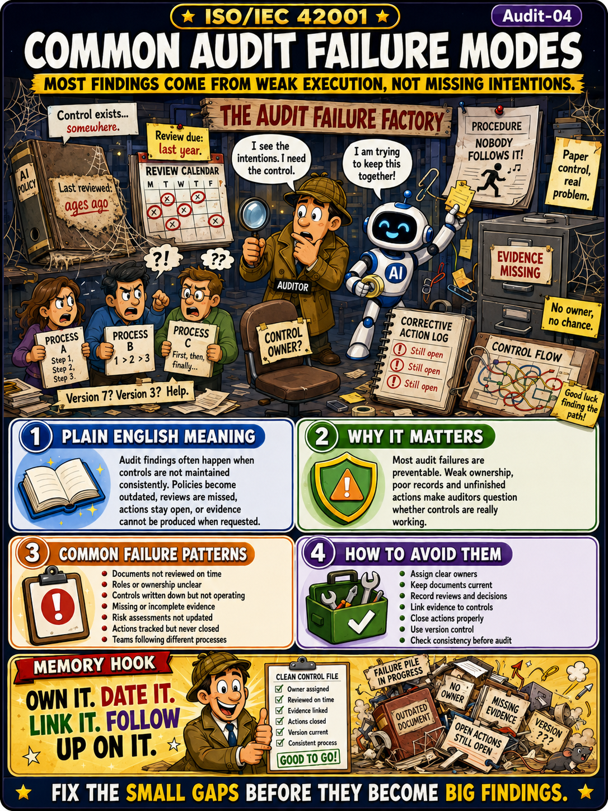</td>
    </tr>
    <tr>
      <td width="16%"><strong>Audit-05</strong><br>How to Talk About Controls Confidently<br><a href="cards/audit/reference/audit-05-how-to-talk-about-controls-confidently.md">Reference ↗</a></td>
      <td width="42%"></td>
      <td width="42%"></td>
    </tr>
  </tbody>
</table>

### Additional variants

Earlier visual styles explored during the development of this library. They have since been superseded by the current card designs, but the content remains accurate. Feel free to use any of these if you prefer the format.


<table>
  <tbody>
    <tr>
      <td width="25%">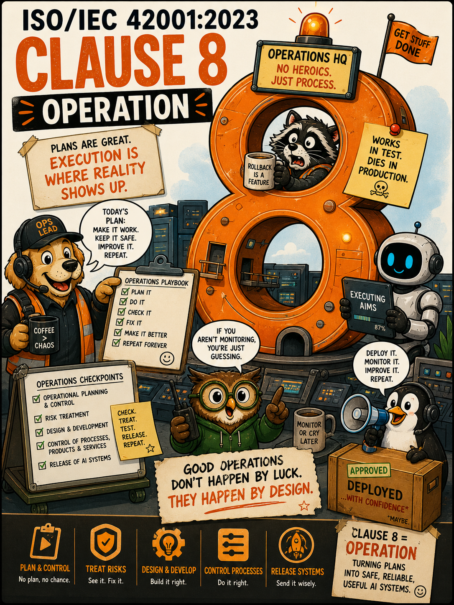</td>
      <td width="25%">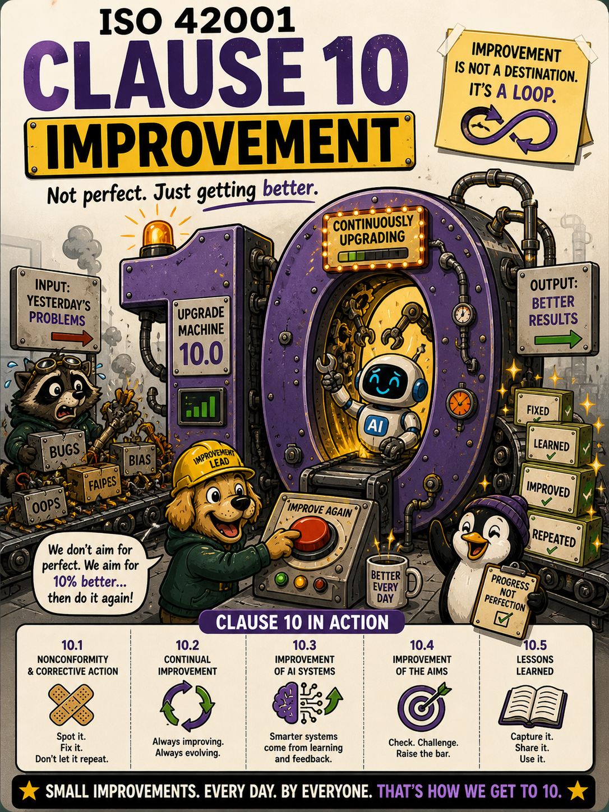</td>
      <td width="25%"></td>
      <td width="25%"></td>
    </tr>
    <tr>
      <td width="25%"></td>
      <td width="25%"></td>
      <td width="25%"></td>
      <td width="25%"></td>
    </tr>
    <tr>
      <td width="25%"></td>
      <td width="25%"></td>
      <td width="25%"></td>
      <td width="25%"></td>
    </tr>
  </tbody>
</table>

## Licence

This work is licensed under the Creative Commons Attribution 4.0 International License. See [LICENSE.md](LICENSE.md) for details.

Suggested attribution:

```text
ISO 42001 Visual Library by Nelson Ambrose, licensed under CC BY 4.0.
```

Creator: [Nelson Ambrose](https://www.linkedin.com/in/nelson-ambrose/)

If you find these useful, please leave a ⭐

## Disclaimer

This repository is an independent learning resource. It is not affiliated with, endorsed by, or certified by ISO, IEC, or any certification body.

The materials are intended as learning aids and should not be treated as a replacement for the official ISO/IEC 42001:2023 standard, legal advice, audit advice, or certification guidance.

## About the Author

A personal visual overview of the author's AI governance focus and role in building the library.


