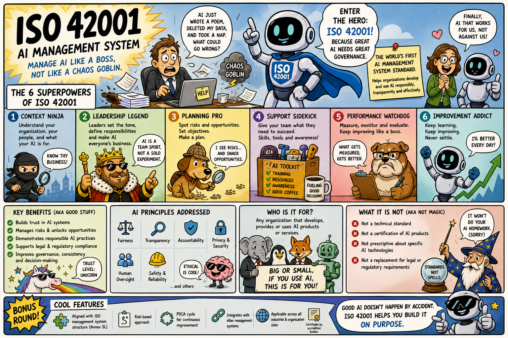

# ISO-42001-Visual-Library

A visual learning library for ISO/IEC 42001:2023 - the international standard for AI Management Systems.

> Status: Work in progress. Current coverage includes the ISO 42001 overview, Annex A overview, domain cards, control cards, and Clauses 4 to 10.

## What this repository is

This repository is a practical visual library for learning and explaining ISO/IEC 42001:2023, the international standard for AI Management Systems (AIMS).

It is designed to make ISO 42001 easier to understand, remember and communicate. The library combines neutral reference material with professional and humorous infographic cards so the same topic can be used for study, briefing, audit preparation and memory reinforcement.

## Why this exists

ISO 42001 is important, but most available material is either very dense, overly generic, or aimed at people who already understand management system standards.

This project fills that gap by turning the standard into clear, reusable learning assets. The goal is to help people build confidence with AI governance concepts without losing accuracy or inventing requirements.

## How the library works

Each topic can have up to four matching assets:

| Layer | Purpose | Best used for |
|---|---|---|
| Reference card | Neutral source facts and reusable explanations | Learning, checking details, creating new cards |
| Professional infographic | Polished business-ready visual summary | Briefings, audit preparation, stakeholder sharing |
| Funny infographic | Humorous visual memory aid | Learning reinforcement and making the topic stick |
| Funny simple memory card | One strong visual hook for clause recall | Remembering clause number and keyword |

The simple memory cards are deliberately minimal. They are designed to help people remember the clause number and core keyword quickly.

The reference card is the canonical content source. The professional and funny infographics are two different treatments of the same topic: one for clear explanation and sharing, the other for memory and engagement. The funny cards use a different style, but they should not introduce different requirements or change the meaning of the standard.

## Who this is for

This library is useful for:

- AI governance leads and responsible AI practitioners
- Risk, compliance, privacy, security and audit teams
- Product, technology and delivery leaders working with AI systems
- Organisations preparing for ISO 42001 implementation or certification
- Anyone learning how AI management systems work

## Current coverage

The library currently covers the ISO 42001 overview, Annex A overview, domain cards, control cards, and Clauses 4 to 10.

| Topic | Reference | Professional infographic | Funny infographic |
|---|---|---|---|
| Overview | [View reference](cards/reference/overview.md) | [View image](cards/professional/overview.png) | [View image](cards/funny/overview.png) |
| Clause 4: Context of the Organisation | [View reference](cards/reference/clause-04-context-of-the-organisation.md) | [View image](cards/professional/clause-04-context-of-the-organisation.png) | [View image](cards/funny/clause-04-context-of-the-organisation.png) |
| Clause 5: Leadership | [View reference](cards/reference/clause-05-leadership.md) | [View image](cards/professional/clause-05-leadership.png) | [View image](cards/funny/clause-05-leadership.png) |
| Clause 6: Planning | [View reference](cards/reference/clause-06-planning.md) | [View image](cards/professional/clause-06-planning.png) | [View image](cards/funny/clause-06-planning.png) |
| Clause 7: Support | [View reference](cards/reference/clause-07-support.md) | [View image](cards/professional/clause-07-support.png) | [View image](cards/funny/clause-07-support.png) |
| Clause 8: Operation | [View reference](cards/reference/clause-08-operation.md) | [View image](cards/professional/clause-08-operation.png) | [View image](cards/funny/clause-08-operation.png) |
| Clause 9: Performance Evaluation | [View reference](cards/reference/clause-09-performance-evaluation.md) | [View image](cards/professional/clause-09-performance-evaluation.png) | [View image](cards/funny/clause-09-performance-evaluation.png) |
| Clause 10: Improvement | [View reference](cards/reference/clause-10-improvement.md) | [View image](cards/professional/clause-10-improvement.png) | [View image](cards/funny/clause-10-improvement.png) |

Annex A coverage currently includes:

- `cards/annex-a/overview/annex-a-overview-professional.png`
- `cards/annex-a/overview/annex-a-overview-funny.png`
- Domain cards for governance, organisation, operation, and relationships under `cards/annex-a/domain/`
- Control cards for A.2 to A.10 under `cards/annex-a/control/`

## How to use it

Start with the reference card when you want the factual explanation of a topic. Use the professional infographic when you need a clean visual for colleagues, leadership or audit preparation. Use the funny infographic when you want the concept to be memorable.

The assets are deliberately short and visual. They are learning aids, not a replacement for the ISO/IEC 42001:2023 standard itself.

## Card gallery

### Clause memory cards

The simple funny cards are designed for quick recall. Each card reduces one clause to its core keyword using a strong visual hook.

These cards are intentionally simple. The goal is not to explain every sub-clause, but to make the main association easy to remember.

- Clause 4 = Context
- Clause 5 = Leadership
- Clause 6 = Planning
- Clause 7 = Support
- Clause 8 = Operation
- Clause 9 = Performance Evaluation
- Clause 10 = Improvement

> [!TIP]
> Click any card to open a full-size view. This is the easiest way to read the detail.

| Clause 4 | Clause 5 | Clause 6 |
|---|---|---|
|  |  |  |
| Clause 7 | Clause 8 | Clause 9 |
|  |  |  |
|  | Clause 10 |  |
|  |  |  |

### Overview

<p>
  
</p>

<p>
  
</p>

### Annex A domain cards


The overview images show how Annex A is grouped. The table below compares the professional and funny versions of each Annex A domain card.

| Domain | Professional | Funny memory card |
|---|---|---|
| Governance |  |  |
| Organisation |  |  |
| Operation |  |  |
| Relationships |  |  |

### Annex A Control Cards

These cards provide individual control-level learning summaries for Annex A. Each control is available in a professional version and a funny version.

| Control | Professional | Funny |
|---|---|---|
| A.2 Policies Related to AI | [Professional](cards/annex-a/control/professional/a-02-policies-related-to-ai.png) | [Funny](cards/annex-a/control/funny/a-02-policies-related-to-ai.png) |
| A.3 Internal Organisation | [Professional](cards/annex-a/control/professional/a-03-internal-organisation.png) | [Funny](cards/annex-a/control/funny/a-03-internal-organisation.png) |
| A.4 Resources for AI Systems | [Professional](cards/annex-a/control/professional/a-04-resources-for-ai-systems.png) | [Funny](cards/annex-a/control/funny/a-04-resources-for-ai-systems.png) |
| A.5 Assessing Impacts of AI Systems | [Professional](cards/annex-a/control/professional/a-05-assessing-impacts-of-ai-systems.png) | [Funny](cards/annex-a/control/funny/a-05-assessing-impacts-of-ai-systems.png) |
| A.6 AI System Life Cycle | [Professional](cards/annex-a/control/professional/a-06-ai-system-life-cycle.png) | [Funny](cards/annex-a/control/funny/a-06-ai-system-life-cycle.png) |
| A.7 Data for AI Systems | [Professional](cards/annex-a/control/professional/a-07-data-for-ai-systems.png) | [Funny](cards/annex-a/control/funny/a-07-data-for-ai-systems.png) |
| A.8 Information for Interested Parties | [Professional](cards/annex-a/control/professional/a-08-information-for-interested-parties.png) | [Funny](cards/annex-a/control/funny/a-08-information-for-interested-parties.png) |
| A.9 Use of AI Systems | [Professional](cards/annex-a/control/professional/a-09-use-of-ai-systems.png) | [Funny](cards/annex-a/control/funny/a-09-use-of-ai-systems.png) |
| A.10 Third-party and Customer Relationships | [Professional](cards/annex-a/control/professional/a-10-third-party-and-customer-relationships.png) | [Funny](cards/annex-a/control/funny/a-10-third-party-and-customer-relationships.png) |

### Clause cards

<table>
  <thead>
    <tr>
      <th width="16%">Topic</th>
      <th width="42%">Professional</th>
      <th width="42%">Funny</th>
    </tr>
  </thead>
  <tbody>
    <tr>
      <td width="16%"><strong>Clause 4</strong><br>Context of the Organisation</td>
      <td width="42%"></td>
      <td width="42%"></td>
    </tr>
    <tr>
      <td width="16%"><strong>Clause 5</strong><br>Leadership</td>
      <td width="42%"></td>
      <td width="42%"></td>
    </tr>
    <tr>
      <td width="16%"><strong>Clause 6</strong><br>Planning</td>
      <td width="42%"></td>
      <td width="42%"></td>
    </tr>
    <tr>
      <td width="16%"><strong>Clause 7</strong><br>Support</td>
      <td width="42%"></td>
      <td width="42%"></td>
    </tr>
    <tr>
      <td width="16%"><strong>Clause 8</strong><br>Operation</td>
      <td width="42%"></td>
      <td width="42%"></td>
    </tr>
    <tr>
      <td width="16%"><strong>Clause 9</strong><br>Performance Evaluation</td>
      <td width="42%"></td>
      <td width="42%"></td>
    </tr>
    <tr>
      <td width="16%"><strong>Clause 10</strong><br>Improvement</td>
      <td width="42%"></td>
      <td width="42%"></td>
    </tr>
  </tbody>
</table>

### Additional variants

| Topic | Variant |
|---|---|
| ISO 42001: Manage Like a Boss |  |
| Clause 8: Operation, Mission Control style |  |

## Roadmap

Planned additions:

- Additional Annex A supporting material
- AI principles
- Certification preparation
- People impact
- ISO 42001 and ISO 27001 comparison
- EU AI Act alignment
- Common audit failure modes
- What an auditor looks for
- AI policy templates

## Licence

This work is licensed under the Creative Commons Attribution 4.0 International License. See [LICENSE.md](LICENSE.md) for details.

Suggested attribution:

```text
ISO 42001 Visual Library by Nelson Ambrose, licensed under CC BY 4.0.
```

Creator: [Nelson Ambrose](https://www.linkedin.com/in/nelson-ambrose/)

## Disclaimer

This repository is an independent learning resource. It is not affiliated with, endorsed by, or certified by ISO, IEC, or any certification body.

The materials are intended as learning aids and should not be treated as a replacement for the official ISO/IEC 42001:2023 standard, legal advice, audit advice, or certification guidance.

## Folder convention

```text
cards/
  annex-a/
    overview/
    domain/
      professional/
      funny/
    control/
      professional/
      funny/
  reference/
  funny/
    simple/
    other/
    expanded/
  professional/
    simple/
  Archive/
```

Use the same topic filename across folders where applicable. For example, an `ai-risk` topic should use `cards/reference/ai-risk.md`, `cards/funny/ai-risk.png`, and `cards/professional/ai-risk.png`.

For Annex A domain cards, use the same basename across `cards/annex-a/domain/professional/` and `cards/annex-a/domain/funny/`. For example, `governance.png` should exist in both folders.

For Annex A control cards, use the same basename across `cards/annex-a/control/professional/` and `cards/annex-a/control/funny/`. For example, `a-02-policies-related-to-ai.png` should exist in both folders.

## Contributor context

See [CONTEXT.md](CONTEXT.md) for project guidance, file naming conventions, content accuracy rules, and the intended library structure.
