# ISO-42001-Visual-Library

[](LICENSE.md)


A collection of professional and humorous infographic cards to help you understand, remember, and explain **ISO/IEC 42001.**

> [!TIP]
> ### View the full gallery
> **[nelsambrose.github.io/ISO-42001-Visual-Library](https://nelsambrose.github.io/ISO-42001-Visual-Library/)** — browse all cards in a clean, searchable page optimised for sharing.

> [!NOTE]
> #### 🔓 Project Access
> <b>Free to use, share, or remix these cards in presentations, training, or anything else you wish to use them for.</b>
> All cards in this repository were created by me and are released under the [MIT Licence](LICENSE.md) — free for any purpose, personal or commercial. Attribution is always appreciated but not required.
>
> If you find them useful, consider leaving a ⭐ — it helps others find the library too.
>
> **87 cards and 32 written reference notes**, covering Clauses 4–10 in full, all four Annex A domains, controls A.2 to A.10, the Audit Readiness mini-deck, and the six AI Principles. Actively maintained and still growing — see [planned additions](#planned-additions).
<br>

<details>
  <summary>Click to expand Table of Contents</summary>
  <br>

  - [What this repository is](#what-this-repository-is)
  - [How the library works](#how-the-library-works)
  - [Recommended learning path](#recommended-learning-path)
  - [Browse by category](#browse-by-category)
  - [ISO 42001 Overview](#iso-42001-overview)
  - [ISO 42001 Clause Memory Cards](#iso-42001-clause-memory-cards)
  - [ISO 42001 Clause Cards](#iso-42001-clause-cards)
  - [ISO 42001 Annex A Domain Cards](#iso-42001-annex-a-domain-cards)
  - [ISO 42001 Annex A Control Cards](#iso-42001-annex-a-control-cards)
  - [ISO 42001 Audit Readiness Cards](#iso-42001-audit-readiness-cards)
  - [ISO 42001 AI Principles Cards](#iso-42001-ai-principles-cards)
  - [Licence](#licence)
</details>

## What this repository is

This repository is a practical visual library for learning and explaining ISO/IEC 42001:2023, the international standard for AI Management Systems (AIMS).

It is designed to make ISO 42001 easier to understand, remember, and explain through visual learning. The library combines professional and humorous infographic cards to support study, awareness, training, presentations, and audit preparation.

## Why this exists

Most ISO 42001 material is dense or assumes prior knowledge. This library turns the standard into short visual cards designed for learning, communication, and memory.

## How the library works

Each topic includes a professional card for clear explanation and sharing, and a funny card for memory and engagement. Some topics also include minimal memory cards focused on clause number and keyword recall.

These assets are learning aids and are not a replacement for the full ISO/IEC 42001:2023 standard.

Project structure and naming conventions are documented in [CONTEXT.md](CONTEXT.md).

## Current coverage

The library currently covers the ISO 42001 overview, Domain cards, Control cards, Clauses 4 to 10, Annex A, the Audit Readiness, and AI Principles.

For Audit Readiness reference material, see the [Audit Readiness reference index](cards/audit/reference/README.md).

## Planned additions

- Expanded Annex A guidance and supporting visuals
- Certification preparation
- People impact and human oversight
- ISO 42001 and ISO 27001 comparison
- EU AI Act alignment
- AI policy templates

## Recommended learning path

New to ISO 42001? Work through the library in this order — each step assumes the one before it.

<details>
<summary>Click to expand</summary>

### 🧭 Start here

1. **[ISO 42001 Overview](#iso-42001-overview)** — the whole standard on one card: the Plan–Do–Check–Act structure, the clause map, and where Annex A fits.
2. **[Clause memory cards](#iso-42001-clause-memory-cards)** — lock in the clause numbers and their keywords before going deeper. Five minutes here saves a lot of confusion later.

### 📋 The mandatory clauses (4–10)

3. [Clause 4 — Context of the Organisation](cards/reference/clause-04-context-of-the-organisation.md) — who is affected by your AI, what pressures shape it, and where the AIMS boundary sits.
4. [Clause 5 — Leadership](cards/reference/clause-05-leadership.md) — the AI policy, assigned accountability, and top management commitment.
5. [Clause 6 — Planning](cards/reference/clause-06-planning.md) — AI risk assessment, AI system impact assessment, and measurable objectives.
6. [Clause 7 — Support](cards/reference/clause-07-support.md) — competence, awareness, communication, and documented information.
7. [Clause 8 — Operation](cards/reference/clause-08-operation.md) — running the processes and retaining the evidence that they ran.
8. [Clause 9 — Performance Evaluation](cards/reference/clause-09-performance-evaluation.md) — monitoring, internal audit, and management review.
9. [Clause 10 — Improvement](cards/reference/clause-10-improvement.md) — nonconformities, corrective action, and continual improvement.

### 🗂️ Annex A controls

10. [Annex A domain overview](#iso-42001-annex-a-domain-cards) — how Governance, Organisation, Operation, and Relationships divide the control set.
11. [A.2 Policies Related to AI](cards/annex-a/reference/control/a-02-policies-related-to-ai.md) — the anchor document auditors ask for first.
12. [A.5 Assessing Impacts of AI Systems](cards/annex-a/reference/control/a-05-assessing-impacts-of-ai-systems.md) — impact assessment, and why it is not the same as risk assessment.
13. [A.6 AI System Life Cycle](cards/annex-a/reference/control/a-06-ai-system-life-cycle.md) — governance built into how systems are made.
14. [A.7 Data for AI Systems](cards/annex-a/reference/control/a-07-data-for-ai-systems.md) — quality and provenance, a frequent focus of audit attention.
15. [All nine controls, A.2 to A.10](#iso-42001-annex-a-control-cards) — the full control set with cards and reference notes.

### 🎓 Getting audit-ready

16. [What an auditor actually looks for](cards/audit/reference/audit-01-what-an-auditor-actually-looks-for.md) — what gets verified, and how.
17. [Evidence vs good intentions](cards/audit/reference/audit-02-evidence-vs-good-intentions.md) — the single largest source of audit findings.
18. [Common audit failure modes across Annex A](cards/audit/reference/audit-04-common-audit-failure-modes-across-annex-a.md) — the patterns that repeat across organisations.

### 🧠 The underlying principles

19. [AI principles cards](#iso-42001-ai-principles-cards) — fairness, transparency, accountability, human oversight, privacy, and safety and reliability.

</details>

## Browse by category

<details>
<summary>Click to expand</summary>

| Category | Cards | |
|---|---:|---|
| ISO 42001 overview | 2 | [View ↗](#iso-42001-overview) |
| Clause memory cards (quick recall) | 14 | [View ↗](#iso-42001-clause-memory-cards) |
| Clause cards, Clauses 4–10 | 14 | [View ↗](#iso-42001-clause-cards) |
| Annex A domain cards | 10 | [View ↗](#iso-42001-annex-a-domain-cards) |
| Annex A control cards, A.2–A.10 | 18 | [View ↗](#iso-42001-annex-a-control-cards) |
| Audit readiness cards | 10 | [View ↗](#iso-42001-audit-readiness-cards) |
| AI principles cards | 12 | [View ↗](#iso-42001-ai-principles-cards) |
| Archive variants | 13 | [View ↗](#iso-42001-additional-variants) |

</details>

## Card gallery

> [!TIP]
> Click any card to open the full-size PNG. This is the easiest way to read the detail. The README shows the professional cards; each topic links to its humorous version, and the [online gallery](https://nelsambrose.github.io/ISO-42001-Visual-Library/) shows every card side by side.

### ISO 42001 Overview

<p align="center">
  <a href="cards/professional/iso-42001-ai-management-system-overview-professional-infographic.png"></a><br>
  <sub><a href="cards/funny/iso-42001-ai-management-system-overview-humorous-infographic.png">Humorous version ↗</a></sub>
</p>

These overview cards show the complete ISO/IEC 42001:2023 AI Management System structure, covering mandatory clauses 4 to 10 and the optional Annex A controls.

### ISO 42001 Clause Memory Cards

The simple memory cards are designed for quick recall. Each card reduces one clause to its core keyword. The professional simple cards use a clean minimal style. The funny simple cards use a strong visual hook.

These cards are intentionally simple. The goal is not to explain every sub-clause, but to make the main association easy to remember.

#### ISO 42001 Professional Simple Memory Cards

| Clause 4 | Clause 5 | Clause 6 |
|:---:|:---:|:---:|
| <a href="cards/professional/simple/iso-42001-clause-04-context-of-the-organisation-professional-simple-memory-card.png">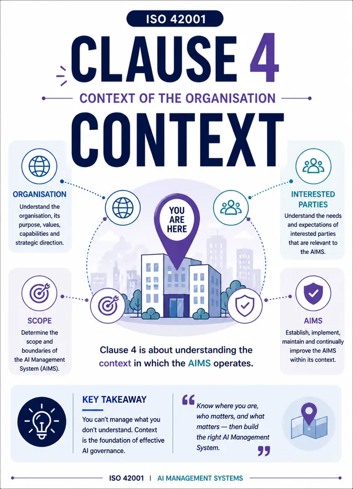</a><br><sub><b>Context.</b> Know your organisation, your interested parties, and the scope of your AIMS.</sub> | <a href="cards/professional/simple/iso-42001-clause-05-leadership-professional-simple-memory-card.png">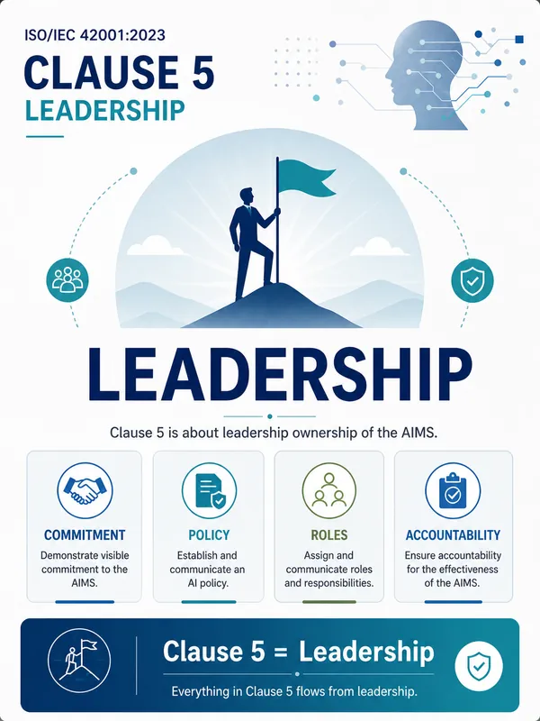</a><br><sub><b>Leadership.</b> Top management sets the AI policy and owns accountability for it.</sub> | <a href="cards/professional/simple/iso-42001-clause-06-planning-professional-simple-memory-card.png">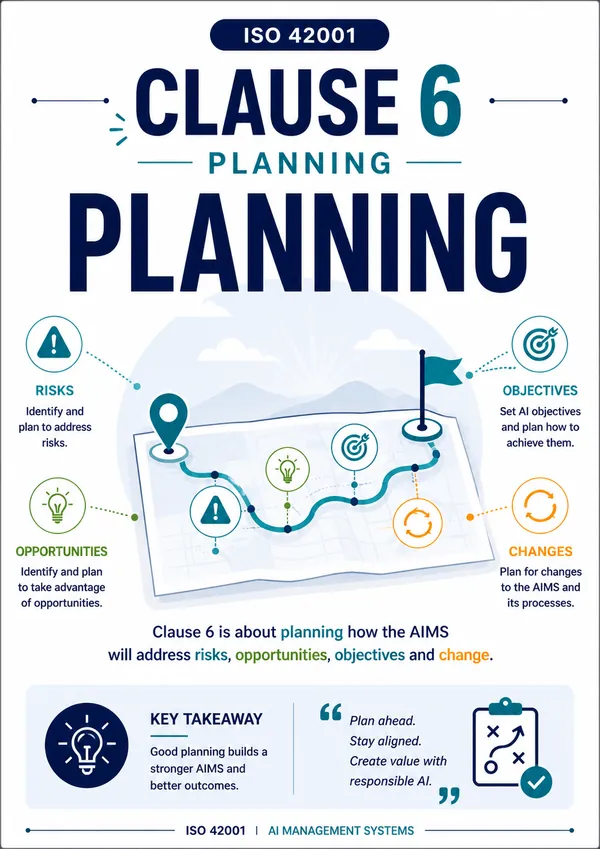</a><br><sub><b>Planning.</b> Assess AI risk and impact, then set measurable objectives.</sub> |
| **Clause 7** | **Clause 8** | **Clause 9** |
| <a href="cards/professional/simple/iso-42001-clause-07-support-professional-simple-memory-card.png">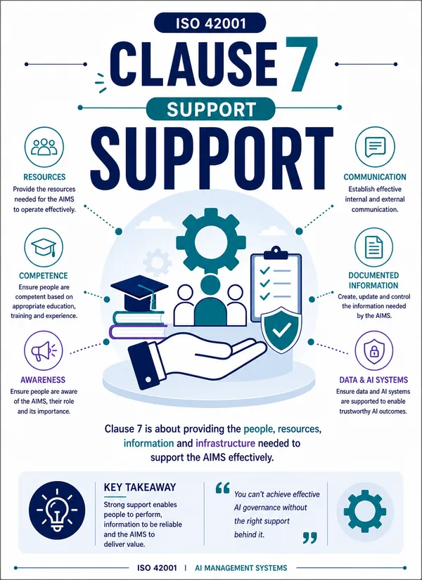</a><br><sub><b>Support.</b> Competence, awareness, communication, and documented information.</sub> | <a href="cards/professional/simple/iso-42001-clause-08-operation-professional-simple-memory-card.png">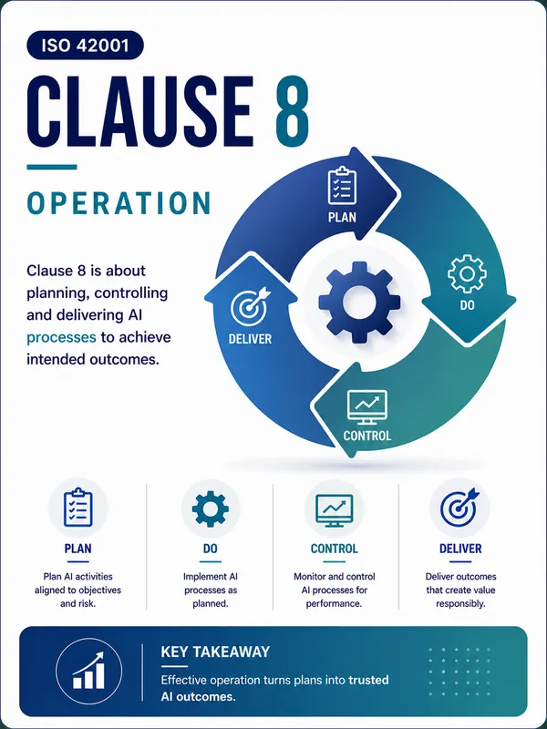</a><br><sub><b>Operation.</b> Run the processes, and keep the evidence that they ran.</sub> | <a href="cards/professional/simple/iso-42001-clause-09-performance-evaluation-professional-simple-memory-card.png"></a><br><sub><b>Performance Evaluation.</b> Monitor, audit internally, and review at management level.</sub> |
|  | **Clause 10** |  |
|  | <a href="cards/professional/simple/iso-42001-clause-10-improvement-professional-simple-memory-card.png"></a><br><sub><b>Improvement.</b> Fix nonconformities at the root and keep improving the system.</sub> |  |

#### ISO 42001 Funny Simple Memory Cards

Humorous versions of the seven simple memory cards (Clauses 4–10), each built around one strong visual hook, are in [`cards/funny/simple/`](cards/funny/simple/) and shown in the [online gallery](https://nelsambrose.github.io/ISO-42001-Visual-Library/#memory-cards).

Simple memory cards for ISO 42001 Clauses 4 to 10, designed for quick keyword recall in study, training, and awareness sessions.

### ISO 42001 Clause Cards

Clauses 4–10 are the mandatory requirements of ISO 42001 - the standards that every organisation must implement. Unlike Annex A (which provides controls to select from), these clauses are non-negotiable. Each clause builds on the previous one, forming a management system cycle.

<table>
  <thead>
    <tr>
      <th width="45%">Topic</th>
      <th width="55%">Professional</th>
    </tr>
  </thead>
  <tbody>
    <tr>
      <td width="45%"><strong>Clause 4</strong><br>Context of the Organisation<br><a href="cards/reference/clause-04-context-of-the-organisation.md">Reference ↗</a> · <a href="cards/funny/iso-42001-clause-04-context-of-the-organisation-humorous-infographic.png">Humorous version ↗</a><br><br><sub>Establishes the foundation of the AI Management System. Before an organisation can govern AI it must understand itself: its purpose, its operating environment, the interested parties who can affect or be affected by its AI activities, and the boundaries within which the AIMS will operate. Clause 4 asks who is affected by your AI, what internal and external pressures shape it, and where the scope of the management system begins and ends. Nothing in Clauses 5 to 10 can be properly designed without this groundwork.</sub></td>
      <td width="55%"><a href="cards/professional/iso-42001-clause-04-context-of-the-organisation-professional-infographic.png"></a></td>
    </tr>
    <tr>
      <td width="45%"><strong>Clause 5</strong><br>Leadership<br><a href="cards/reference/clause-05-leadership.md">Reference ↗</a> · <a href="cards/funny/iso-42001-clause-05-leadership-humorous-infographic.png">Humorous version ↗</a><br><br><sub>Turns the AIMS from an idea into an organisational commitment. Clause 5 requires top management to actively lead AI governance, set direction through a documented AI policy, and ensure responsibilities and authorities are clearly assigned. ISO 42001 does not treat AI governance as something that can be delegated entirely to technical teams, compliance functions, or individual model owners. This is the clause where AI governance either gains real organisational authority and budget, or quietly stalls as a side project that nobody genuinely owns.</sub></td>
      <td width="55%"><a href="cards/professional/iso-42001-clause-05-leadership-professional-infographic.png">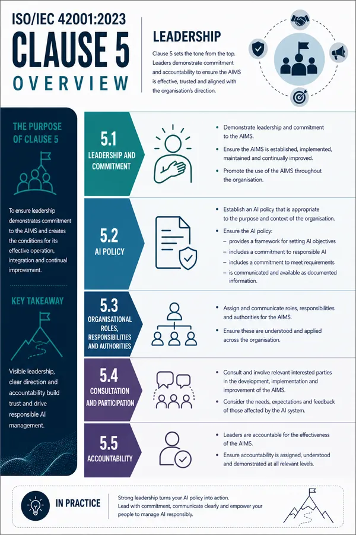</a></td>
    </tr>
    <tr>
      <td width="45%"><strong>Clause 6</strong><br>Planning<br><a href="cards/reference/clause-06-planning.md">Reference ↗</a> · <a href="cards/funny/iso-42001-clause-06-planning-humorous-infographic.png">Humorous version ↗</a><br><br><sub>Where the organisation plans how the AIMS will address AI-related risk, opportunity, objectives and change. Clause 6 connects the context established in Clause 4 and the leadership direction set in Clause 5 to practical, risk-based governance. It asks the organisation to decide what could go wrong, what needs to go right, which measurable AI objectives it will pursue, and how changes to the management system will be controlled. Both AI risk assessment and AI system impact assessment originate here.</sub></td>
      <td width="55%"><a href="cards/professional/iso-42001-clause-06-planning-professional-infographic.png"></a></td>
    </tr>
    <tr>
      <td width="45%"><strong>Clause 7</strong><br>Support<br><a href="cards/reference/clause-07-support.md">Reference ↗</a> · <a href="cards/funny/iso-42001-clause-07-support-humorous-infographic.png">Humorous version ↗</a><br><br><sub>Makes sure the AIMS has what it needs to work in practice. Clause 7 covers resources, competence, awareness, communication and documented information. This is the operational enablement layer: an AI policy and a risk process will not succeed unless people have the right skills, the right tools, clear communication channels and reliable records. The documented information requirements here are also where most audit evidence is eventually drawn from, so weak implementation of Clause 7 tends to surface later as missing evidence.</sub></td>
      <td width="55%"><a href="cards/professional/iso-42001-clause-07-support-professional-infographic.png"></a></td>
    </tr>
    <tr>
      <td width="45%"><strong>Clause 8</strong><br>Operation<br><a href="cards/reference/clause-08-operation.md">Reference ↗</a> · <a href="cards/funny/iso-42001-clause-08-operation-humorous-infographic.png">Humorous version ↗</a><br><br><sub>Where the AIMS moves from planning into controlled operation. Clause 8 requires the organisation to operate the processes needed to meet AIMS requirements, manage AI risk, carry out AI system impact assessments, and control operational change. This is the practical delivery layer of ISO 42001, where governance is applied to real AI systems, real users, real data and real organisational decisions. It also requires retaining documented evidence that those processes actually ran as planned, not merely that they exist on paper.</sub></td>
      <td width="55%"><a href="cards/professional/iso-42001-clause-08-operation-professional-infographic.png">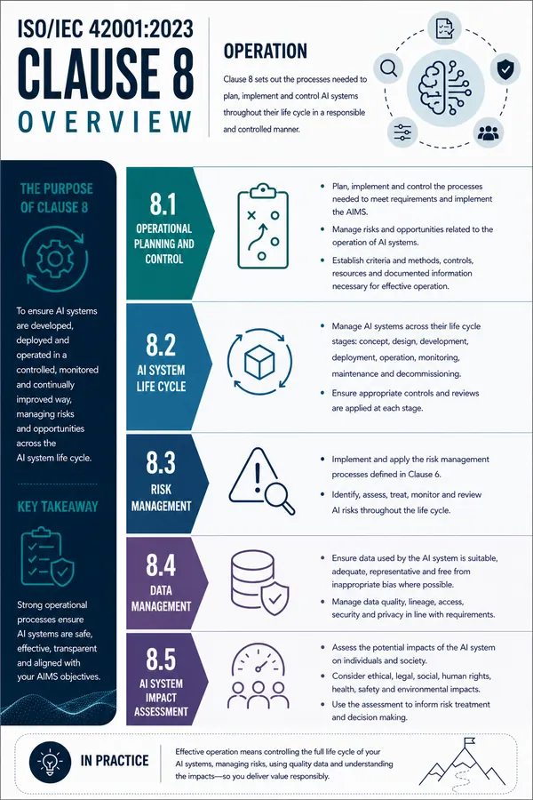</a></td>
    </tr>
    <tr>
      <td width="45%"><strong>Clause 9</strong><br>Performance Evaluation<br><a href="cards/reference/clause-09-performance-evaluation.md">Reference ↗</a> · <a href="cards/funny/iso-42001-clause-09-performance-evaluation-humorous-infographic.png">Humorous version ↗</a><br><br><sub>Checks whether the AIMS is actually working. Clause 9 requires the organisation to monitor, measure, analyse and evaluate AIMS performance, conduct internal audits, and hold management reviews at planned intervals. This is the evidence loop: it establishes what gets measured, who checks it independently of the people doing the work, and how top management formally reviews whether the system remains suitable, adequate and effective. Internal audit findings raised under this clause feed directly into the corrective action required by Clause 10.</sub></td>
      <td width="55%"><a href="cards/professional/iso-42001-clause-09-performance-evaluation-professional-infographic.png"></a></td>
    </tr>
    <tr>
      <td width="45%"><strong>Clause 10</strong><br>Improvement<br><a href="cards/reference/clause-10-improvement.md">Reference ↗</a> · <a href="cards/funny/iso-42001-clause-10-improvement-humorous-infographic.png">Humorous version ↗</a><br><br><sub>Makes continual improvement a permanent part of the AIMS. Clause 10 requires the organisation to respond to nonconformities, take corrective action that addresses root causes rather than symptoms, and improve the suitability, adequacy and effectiveness of the management system over time. This clause is about learning. AI systems, risks, regulations, stakeholders and use cases all change quickly, so an AIMS that cannot adapt will steadily drift out of alignment with the organisation it is meant to govern.</sub></td>
      <td width="55%"><a href="cards/professional/iso-42001-clause-10-improvement-professional-infographic.png">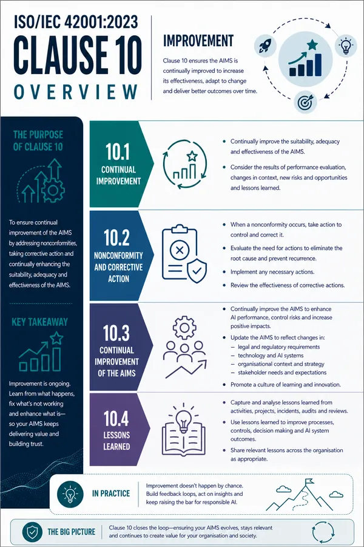</a></td>
    </tr>
  </tbody>
</table>

Full infographic cards for ISO 42001 Clauses 4 to 10 — the mandatory requirements every organisation must implement to achieve ISO/IEC 42001:2023 certification.

Annex A is the operational core of ISO 42001. It contains controls across nine areas (A.2–A.10) that define what responsible AI management looks like in practice.

### ISO 42001 Annex A Domain Cards

These controls are grouped into four non-compulsory domains, and can be selected based on the organisation's AI risks, context, and objectives:

- **Governance** - Establishing AI policies, leadership accountability, and the overall direction for responsible AI within the organisation.
- **Organisation** - Defining internal roles and responsibilities, ensuring the right people, skills, and resources are in place to manage AI effectively.
- **Operation** - Managing the full AI system lifecycle: from design and data management through deployment, monitoring, and decommissioning.
- **Relationships** - Governing how the organisation works with third parties, customers, and other stakeholders who develop, supply, or are affected by AI systems.

<p align="center">
  <a href="cards/annex-a/overview/iso-42001-annex-a-overview-professional-infographic.png"></a><br>
  <sub><a href="cards/annex-a/overview/iso-42001-annex-a-overview-humorous-infographic.png">Humorous version ↗</a></sub>
</p>

ISO 42001 Annex A groups controls across four domains: Governance, Organisation, Operation, and Relationships.

<table>
  <thead>
    <tr>
      <th width="45%">Domain</th>
      <th width="55%">Professional</th>
    </tr>
  </thead>
  <tbody>
    <tr>
      <td width="45%">Governance<br><a href="cards/annex-a/reference/domain/governance.md">Reference ↗</a> · <a href="cards/annex-a/domain/funny/iso-42001-annex-a-governance-domain-humorous-infographic.png">Humorous version ↗</a><br><br><sub>Establishes the policies, leadership accountability and organisational direction needed for responsible AI management. The Governance domain sets the tone from the top and ensures that AI-related commitments are documented, communicated and owned by named people. Without these controls an organisation may develop or deploy AI with no clear principles, no defined accountability, and no shared understanding of what responsible AI actually means in its particular context. This is typically the first domain an auditor examines, because everything else depends on it.</sub></td>
      <td width="55%"><a href="cards/annex-a/domain/professional/iso-42001-annex-a-governance-domain-professional-infographic.png">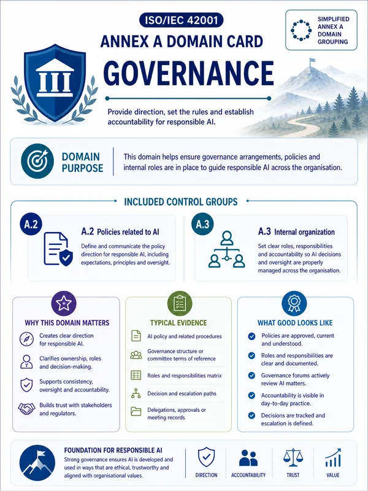</a></td>
    </tr>
    <tr>
      <td width="45%">Organisation<br><a href="cards/annex-a/reference/domain/organisation.md">Reference ↗</a> · <a href="cards/annex-a/domain/funny/iso-42001-annex-a-organisation-domain-humorous-infographic.png">Humorous version ↗</a><br><br><sub>Ensures the right people, skills and resources are in place to manage AI responsibly. The Organisation domain translates Governance-level policy into operational capability: who does what, with what competence, and supported by what resources. It is the bridge between stated intent and the ability to act on it. Organisations frequently write a strong AI policy and then fall down here, leaving controls formally assigned but unresourced — a pattern that shows up quickly once an auditor asks who actually performs them.</sub></td>
      <td width="55%"><a href="cards/annex-a/domain/professional/iso-42001-annex-a-organisation-domain-professional-infographic.png"></a></td>
    </tr>
    <tr>
      <td width="45%">Operation<br><a href="cards/annex-a/reference/domain/operation.md">Reference ↗</a> · <a href="cards/annex-a/domain/funny/iso-42001-annex-a-operation-domain-humorous-infographic.png">Humorous version ↗</a><br><br><sub>Covers the full lifecycle of AI systems, from design and data management through development, deployment, monitoring and eventual decommissioning. This is the largest domain in Annex A and where most of an organisation's AI risk is either actively managed or quietly left unaddressed. The majority of day-to-day AI governance work sits here, and it is where the gap between documented process and actual practice tends to be widest, which makes it a consistently rich source of audit findings.</sub></td>
      <td width="55%"><a href="cards/annex-a/domain/professional/iso-42001-annex-a-operation-domain-professional-infographic.png"></a></td>
    </tr>
    <tr>
      <td width="45%">Relationships<br><a href="cards/annex-a/reference/domain/relationships.md">Reference ↗</a> · <a href="cards/annex-a/domain/funny/iso-42001-annex-a-relationships-domain-humorous-infographic.png">Humorous version ↗</a><br><br><sub>Governs how the organisation manages AI-related obligations with third parties, customers, and others who develop, supply, deploy or are affected by AI systems. AI systems rarely exist in isolation: they depend on data from suppliers, infrastructure from cloud providers, and models from third-party vendors. This domain ensures those dependencies are governed rather than assumed, and that responsibility for AI outcomes is explicitly allocated wherever a system crosses an organisational boundary and ownership could otherwise fall between two parties.</sub></td>
      <td width="55%"><a href="cards/annex-a/domain/professional/iso-42001-annex-a-relationships-domain-professional-infographic.png">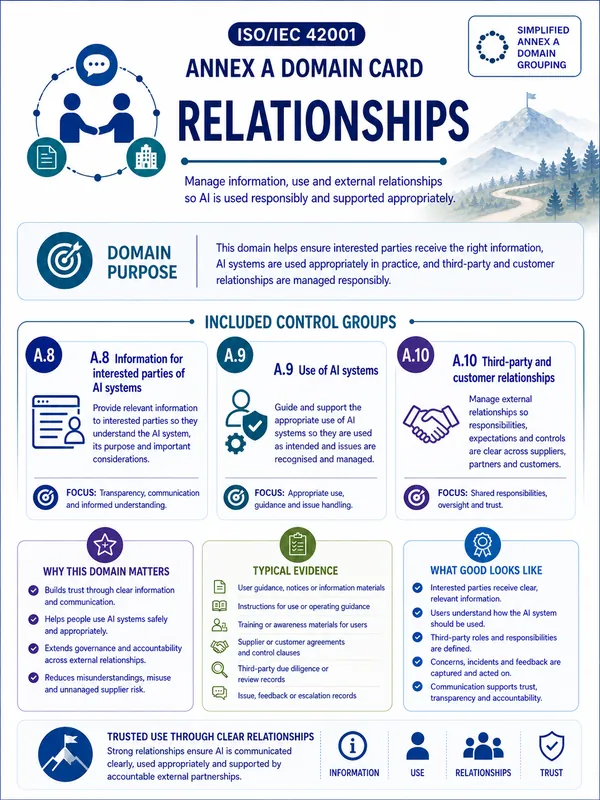</a></td>
    </tr>
  </tbody>
</table>

Domain-level cards for ISO 42001 Annex A, covering governance, organisation, operation, and relationship controls for responsible AI management.

### ISO 42001 Annex A Control Cards

Annex A controls are recommended governance measures that help organisations manage AI systems responsibly across the areas mentioned below.

<table>
  <thead>
    <tr>
      <th width="45%">Control</th>
      <th width="55%">Professional</th>
    </tr>
  </thead>
  <tbody>
    <tr>
      <td width="45%"><strong>A.2</strong> Policies Related to AI<br><a href="cards/annex-a/reference/control/a-02-policies-related-to-ai.md">Reference ↗</a> · <a href="cards/annex-a/control/funny/iso-42001-annex-a-02-policies-related-to-ai-humorous-infographic.png">Humorous version ↗</a><br><br><sub>Requires the organisation to establish and maintain policies defining its approach to responsible AI. Policies are the written foundation for everything else: they define what the organisation stands for, what is permitted and what is not, and they must align with business strategy and other organisational policies. A.2 also requires review at planned intervals. This is the anchor document auditors ask for first, and a policy carrying no evidence of having been reviewed is a very common early finding.</sub></td>
      <td width="55%"><a href="cards/annex-a/control/professional/iso-42001-annex-a-02-policies-related-to-ai-professional-infographic.png">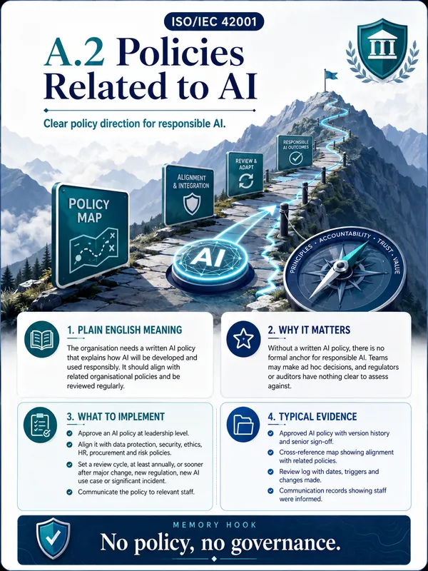</a></td>
    </tr>
    <tr>
      <td width="45%"><strong>A.3</strong> Internal Organisation<br><a href="cards/annex-a/reference/control/a-03-internal-organisation.md">Reference ↗</a> · <a href="cards/annex-a/control/funny/iso-42001-annex-a-03-internal-organisation-humorous-infographic.png">Humorous version ↗</a><br><br><sub>Requires the organisation to define and assign AI governance roles, responsibilities and authorities, and to establish how concerns are reported and escalated. A.3 ensures somebody is accountable for every significant AI decision, and that AI governance is not treated as a shared but ultimately unowned responsibility. In practice this means naming individuals rather than teams, because an auditor asking who owns a given control needs an answer that resolves to a person who can be interviewed.</sub></td>
      <td width="55%"><a href="cards/annex-a/control/professional/iso-42001-annex-a-03-internal-organisation-professional-infographic.png">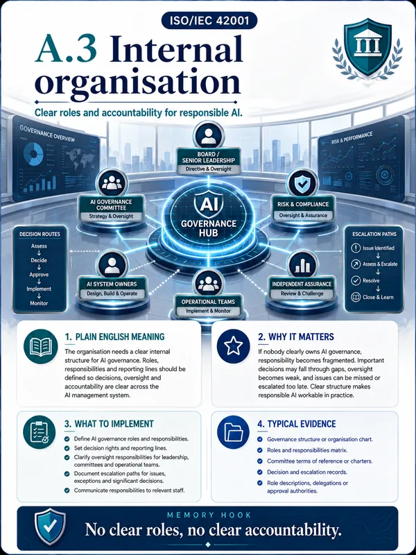</a></td>
    </tr>
    <tr>
      <td width="45%"><strong>A.4</strong> Resources for AI Systems<br><a href="cards/annex-a/reference/control/a-04-resources-for-ai-systems.md">Reference ↗</a> · <a href="cards/annex-a/control/funny/iso-42001-annex-a-04-resources-for-ai-systems-humorous-infographic.png">Humorous version ↗</a><br><br><sub>Requires the organisation to ensure sufficient and appropriate resources support the development, deployment, operation and governance of AI systems — data, tooling, computing resources, human resources and system components. Responsible AI management cannot happen without the people, tools and investment to make it real. Documenting these dependencies serves a second purpose too: understanding what an AI system actually relies on is the necessary basis for assessing what can go wrong with it and where.</sub></td>
      <td width="55%"><a href="cards/annex-a/control/professional/iso-42001-annex-a-04-resources-for-ai-systems-professional-infographic.png">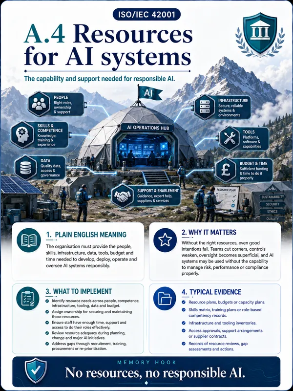</a></td>
    </tr>
    <tr>
      <td width="45%"><strong>A.5</strong> Assessing Impacts of AI Systems<br><a href="cards/annex-a/reference/control/a-05-assessing-impacts-of-ai-systems.md">Reference ↗</a> · <a href="cards/annex-a/control/funny/iso-42001-annex-a-05-assessing-impacts-of-ai-systems-humorous-infographic.png">Humorous version ↗</a><br><br><sub>Requires the organisation to assess the potential impacts of AI systems, including intended benefits and unintended harms, before deployment and throughout the system's lifecycle. Impact assessment is the mechanism by which AI risk is made visible and manageable. It is deliberately distinct from risk assessment: risk assessment looks inward at what threatens the organisation, while impact assessment looks outward at consequences for individuals, groups and society. Conflating the two is a frequent source of audit findings.</sub></td>
      <td width="55%"><a href="cards/annex-a/control/professional/iso-42001-annex-a-05-assessing-impacts-of-ai-systems-professional-infographic.png">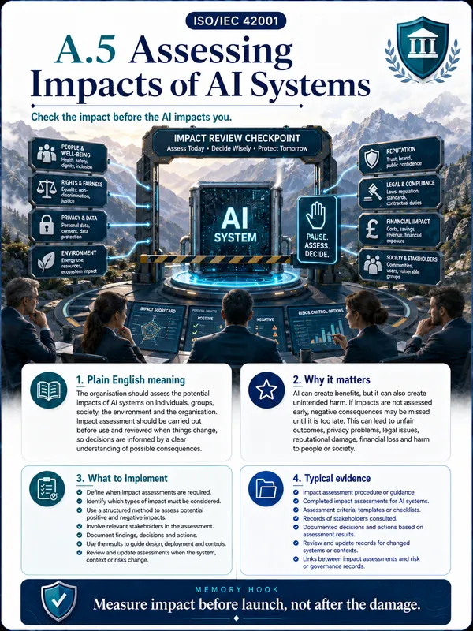</a></td>
    </tr>
    <tr>
      <td width="45%"><strong>A.6</strong> AI System Life Cycle<br><a href="cards/annex-a/reference/control/a-06-ai-system-life-cycle.md">Reference ↗</a> · <a href="cards/annex-a/control/funny/iso-42001-annex-a-06-ai-system-life-cycle-humorous-infographic.png">Humorous version ↗</a><br><br><sub>Requires the organisation to manage AI systems across their full lifecycle — from initial concept and design through development, testing, deployment, operation, monitoring and eventual decommissioning. Each stage carries distinct risks needing specific controls, so governance has to be built into how systems are made rather than bolted on shortly before launch. Decommissioning is the stage most often overlooked, yet retired models and their training data frequently remain accessible long after anyone is actively maintaining them.</sub></td>
      <td width="55%"><a href="cards/annex-a/control/professional/iso-42001-annex-a-06-ai-system-life-cycle-professional-infographic.png">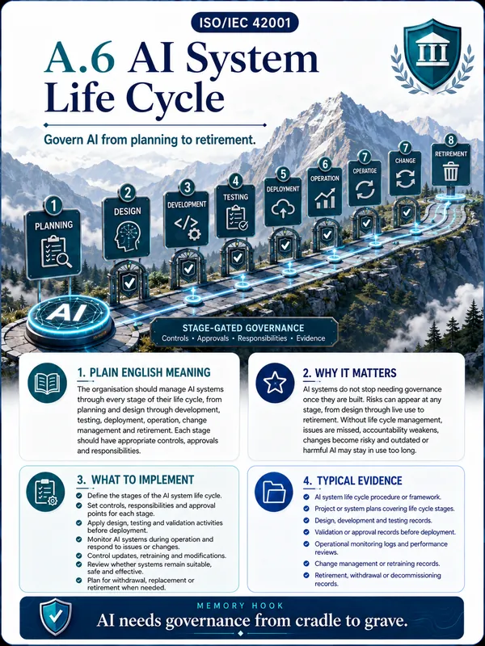</a></td>
    </tr>
    <tr>
      <td width="45%"><strong>A.7</strong> Data for AI Systems<br><a href="cards/annex-a/reference/control/a-07-data-for-ai-systems.md">Reference ↗</a> · <a href="cards/annex-a/control/funny/iso-42001-annex-a-07-data-for-ai-systems-humorous-infographic.png">Humorous version ↗</a><br><br><sub>Requires the organisation to manage the data used in AI systems responsibly, covering quality, provenance, preparation and acquisition. Data is the foundation of AI performance: poor quality, biased or inappropriately sourced data leads directly to unreliable or harmful outputs, and no amount of downstream governance fully compensates for it. Because AI behaviour is largely inherited from its training data, this control attracts sustained audit attention, particularly around whether provenance can actually be demonstrated rather than assumed.</sub></td>
      <td width="55%"><a href="cards/annex-a/control/professional/iso-42001-annex-a-07-data-for-ai-systems-professional-infographic.png">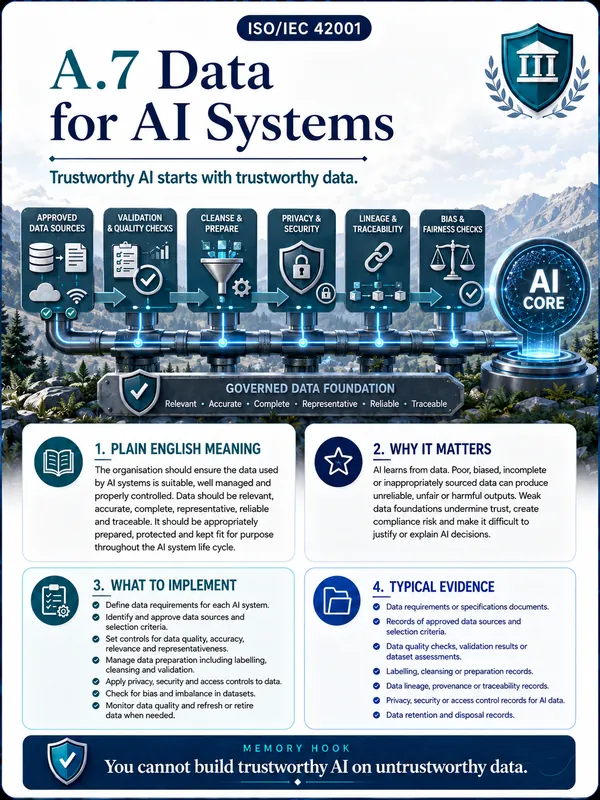</a></td>
    </tr>
    <tr>
      <td width="45%"><strong>A.8</strong> Information for Interested Parties<br><a href="cards/annex-a/reference/control/a-08-information-for-interested-parties.md">Reference ↗</a> · <a href="cards/annex-a/control/funny/iso-42001-annex-a-08-information-for-interested-parties-humorous-infographic.png">Humorous version ↗</a><br><br><sub>Requires the organisation to provide appropriate information about its AI systems to relevant stakeholders. Transparency about how a system works, what decisions it influences, what its limitations are, and what recourse exists is a core component of responsible AI governance. A.8 covers documentation, incident reporting, and communication of both capabilities and limitations. It is the control most directly connected to the transparency principle, and increasingly to external regulatory expectations such as the EU AI Act.</sub></td>
      <td width="55%"><a href="cards/annex-a/control/professional/iso-42001-annex-a-08-information-for-interested-parties-professional-infographic.png">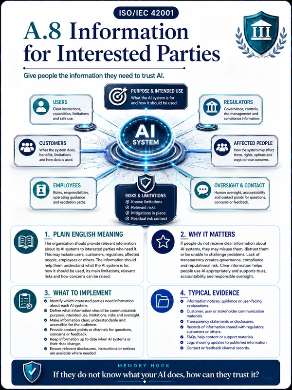</a></td>
    </tr>
    <tr>
      <td width="45%"><strong>A.9</strong> Use of AI Systems<br><a href="cards/annex-a/reference/control/a-09-use-of-ai-systems.md">Reference ↗</a> · <a href="cards/annex-a/control/funny/iso-42001-annex-a-09-use-of-ai-systems-humorous-infographic.png">Humorous version ↗</a><br><br><sub>Requires the organisation to ensure AI systems are used within their intended purpose, with appropriate controls applied when they are. A.9 covers defining intended use, ensuring systems are used in line with policy, and monitoring for misuse or for use outside the intended context. Critically, organisations that use third-party AI rather than building their own cannot transfer accountability by pointing at the supplier: the obligation to govern how a system is used stays with the user.</sub></td>
      <td width="55%"><a href="cards/annex-a/control/professional/iso-42001-annex-a-09-use-of-ai-systems-professional-infographic.png">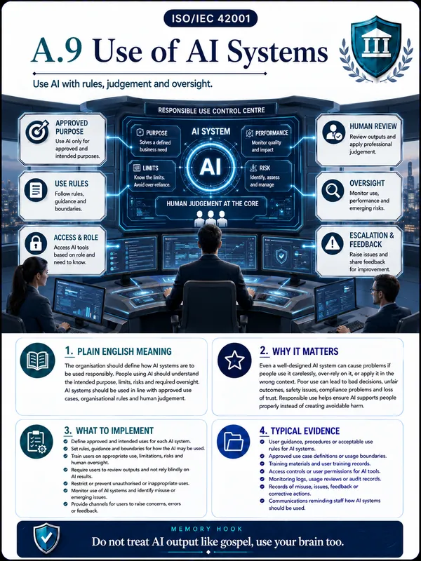</a></td>
    </tr>
    <tr>
      <td width="45%"><strong>A.10</strong> Third-party and Customer Relationships<br><a href="cards/annex-a/reference/control/a-10-third-party-and-customer-relationships.md">Reference ↗</a> · <a href="cards/annex-a/control/funny/iso-42001-annex-a-10-third-party-and-customer-relationships-humorous-infographic.png">Humorous version ↗</a><br><br><sub>Requires the organisation to manage AI-related obligations with third parties and customers, including supplier due diligence, contractual requirements, and ensuring that AI systems provided to customers are fit for purpose and responsibly governed. This control allocates responsibility across the AI supply chain so obligations, expectations and risks are understood and documented wherever a system crosses an organisational boundary. Gaps here usually surface as assumptions, with each party believing the other was handling a given control.</sub></td>
      <td width="55%"><a href="cards/annex-a/control/professional/iso-42001-annex-a-10-third-party-and-customer-relationships-professional-infographic.png">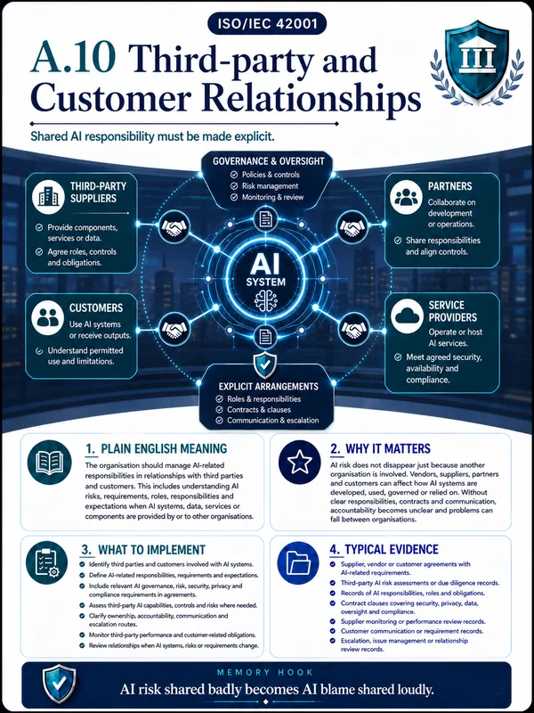</a></td>
    </tr>
  </tbody>
</table>

Control-level cards covering ISO 42001 Annex A controls A.2 through A.10, from AI policies and internal organisation to third-party and customer relationships.

## ISO 42001 Audit Readiness Cards

These five cards help you prepare for ISO 42001 audits. They cover what auditors actually look for, the difference between strong and weak evidence, common failure patterns across Annex A, and how to talk about controls confidently.

Reference files available for all five cards. See the [Audit Readiness reference index](cards/audit/reference/README.md) for an overview.

<table>
  <thead>
    <tr>
      <th width="45%">Card</th>
      <th width="55%">Professional</th>
    </tr>
  </thead>
  <tbody>
    <tr>
      <td width="45%"><strong>Audit-01</strong><br>What an Auditor Actually Looks For<br><a href="cards/audit/reference/audit-01-what-an-auditor-actually-looks-for.md">Reference ↗</a> · <a href="cards/audit/funny/iso-42001-audit-01-what-an-auditor-actually-looks-for-humorous-infographic.png">Humorous version ↗</a><br><br><sub>Explains the auditor mindset: what an auditor is assessing, how they think about evidence, and what they are trying to establish when examining an AI management system. Auditors verify that controls are defined, operating and maintained, and that you can demonstrate all three. Understanding this shifts preparation away from producing more documentation and towards being able to show that documented processes actually ran, were reviewed, and left records somebody independent can check.</sub></td>
      <td width="55%"><a href="cards/audit/professional/iso-42001-audit-01-what-an-auditor-actually-looks-for-professional-infographic.png"></a></td>
    </tr>
    <tr>
      <td width="45%"><strong>Audit-02</strong><br>Evidence vs Good Intentions<br><a href="cards/audit/reference/audit-02-evidence-vs-good-intentions.md">Reference ↗</a> · <a href="cards/audit/funny/iso-42001-audit-02-evidence-vs-good-intentions-humorous-infographic.png">Humorous version ↗</a><br><br><sub>Explains why good intentions, verbal assurances and planned actions carry very little weight in an audit. "We always check that before deployment" is an intention; an approved policy with a version number, date and named owner, or a completed checklist showing the check was carried out, is evidence. Evidence is tangible, can be pointed to, and does not require the auditor to take your word for it. The gap between intention and evidence is where audit findings are born.</sub></td>
      <td width="55%"><a href="cards/audit/professional/iso-42001-audit-02-evidence-vs-good-intentions-professional-infographic.png"></a></td>
    </tr>
    <tr>
      <td width="45%"><strong>Audit-03</strong><br>Strong Versus Weak Evidence Examples<br><a href="cards/audit/reference/audit-03-strong-versus-weak-evidence-examples.md">Reference ↗</a> · <a href="cards/audit/funny/iso-42001-audit-03-strong-versus-weak-evidence-examples-humorous-infographic.png">Humorous version ↗</a><br><br><sub>Gives practical, grounded examples of what weak, better and strong evidence looks like across the key Annex A control areas, so practitioners can assess and improve the quality of their own evidence before an audit rather than during one. Seeing the same control evidenced three different ways makes the difference concrete: the progression usually runs from "we have a document", to "the document is current and owned", to "here is the record of it being applied".</sub></td>
      <td width="55%"><a href="cards/audit/professional/iso-42001-audit-03-strong-versus-weak-evidence-examples-professional-infographic.png">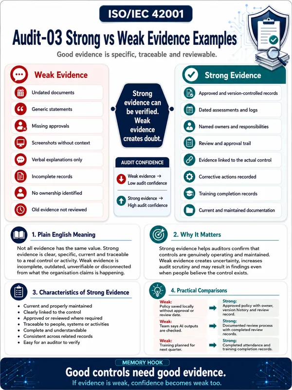</a></td>
    </tr>
    <tr>
      <td width="45%"><strong>Audit-04</strong><br>Common Audit Failure Modes Across Annex A<br><a href="cards/audit/reference/audit-04-common-audit-failure-modes-across-annex-a.md">Reference ↗</a> · <a href="cards/audit/funny/iso-42001-audit-04-common-audit-failure-modes-across-annex-a-humorous-infographic.png">Humorous version ↗</a><br><br><sub>Identifies the recurring patterns that weaken audit confidence across Annex A: controls selected in the Statement of Applicability but never actually operated, documentation with no evidence of review, ownership assigned to a team rather than a named person, and gaps between what the SoA claims and what happens in practice. Recognising these before an audit is far cheaper than having an auditor find them, since each one typically generates a nonconformity requiring corrective action.</sub></td>
      <td width="55%"><a href="cards/audit/professional/iso-42001-audit-04-common-audit-failure-modes-across-annex-a-professional-infographic.png">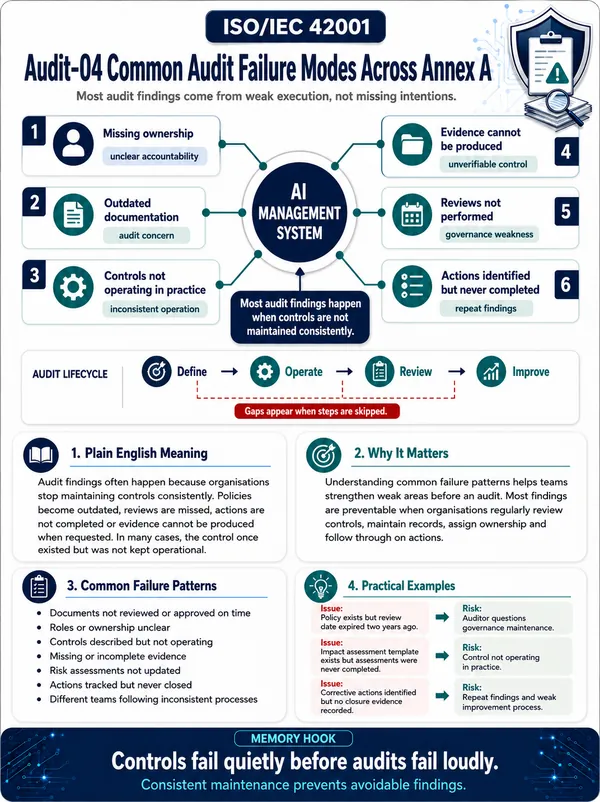</a></td>
    </tr>
    <tr>
      <td width="45%"><strong>Audit-05</strong><br>How to Talk About Controls Confidently<br><a href="cards/audit/reference/audit-05-how-to-talk-about-controls-confidently.md">Reference ↗</a> · <a href="cards/audit/funny/iso-42001-audit-05-how-to-talk-about-controls-confidently-humorous-infographic.png">Humorous version ↗</a><br><br><sub>Helps practitioners communicate clearly and honestly about controls during an audit conversation, covering what the control is, who owns it, how it operates, what evidence exists, and how it is reviewed and improved. The aim is neither over-claiming nor underselling genuine work. Auditors respond well to a structured, factual answer that acknowledges limitations, and poorly to vague reassurance, so knowing the shape of a good answer in advance materially changes how an interview goes.</sub></td>
      <td width="55%"><a href="cards/audit/professional/iso-42001-audit-05-how-to-talk-about-controls-confidently-professional-infographic.png">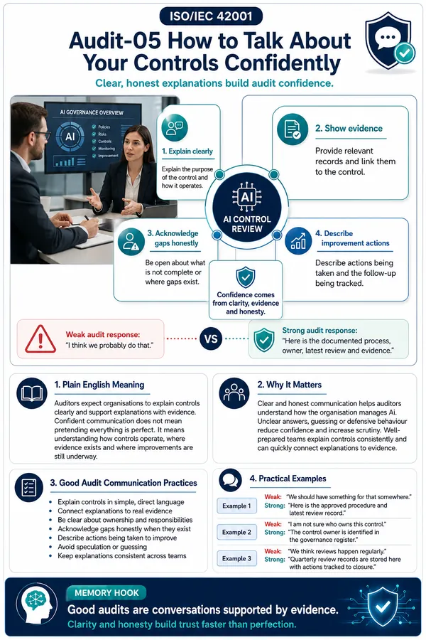</a></td>
    </tr>
  </tbody>
</table>

ISO 42001 audit readiness cards covering auditor expectations, evidence standards, common Annex A failure patterns, and how to communicate controls confidently.

### ISO 42001 AI Principles Cards

The AI Principles Cards explain core responsible AI concepts that support practical AI governance and AI Management System thinking. They cover fairness, transparency, accountability, human oversight, privacy, and safety and reliability. Each principle is shown as a professional card for clear explanation and a funny card for memory and engagement.

> These cards are learning aids. They do not add new ISO/IEC 42001 requirements and should not be treated as a replacement for the official standard.

<table>
  <thead>
    <tr>
      <th width="45%">Principle</th>
      <th width="55%">Professional</th>
    </tr>
  </thead>
  <tbody>
    <tr>
      <td width="45%"><strong>Principle-01</strong><br>Fairness<br><a href="cards/ai-principles/reference/iso-42001-ai-principles-principle-01-fairness.md">Reference ↗</a> · <a href="cards/ai-principles/funny/iso-42001-ai-principles-principle-01-fairness-humorous-infographic.png">Humorous version ↗</a><br><br><sub>Fairness in AI means systems should treat people equitably and avoid producing biased or discriminatory outcomes. It requires organisations to consider how AI decisions may affect different groups, and to take active steps to identify and reduce unfair bias throughout the AI lifecycle. In practice this is harder than it sounds: competing mathematical definitions of fairness cannot all be satisfied at once, so organisations must decide which applies in their context and be able to justify that choice.</sub></td>
      <td width="55%"><a href="cards/ai-principles/professional/iso-42001-ai-principles-principle-01-fairness-professional-infographic.png"></a></td>
    </tr>
    <tr>
      <td width="45%"><strong>Principle-02</strong><br>Transparency<br><a href="cards/ai-principles/reference/iso-42001-ai-principles-principle-02-transparency.md">Reference ↗</a> · <a href="cards/ai-principles/funny/iso-42001-ai-principles-principle-02-transparency-humorous-infographic.png">Humorous version ↗</a><br><br><sub>Transparency means being open about how AI systems work, what data they use, and how decisions are reached. Organisations should be able to explain AI behaviour in terms that are meaningful to the people affected by it, even when the underlying models are complex. It also covers whether someone knows they are interacting with an AI system at all. Transparency builds stakeholder trust and directly underpins the Annex A.8 obligations to inform interested parties.</sub></td>
      <td width="55%"><a href="cards/ai-principles/professional/iso-42001-ai-principles-principle-02-transparency-professional-infographic.png">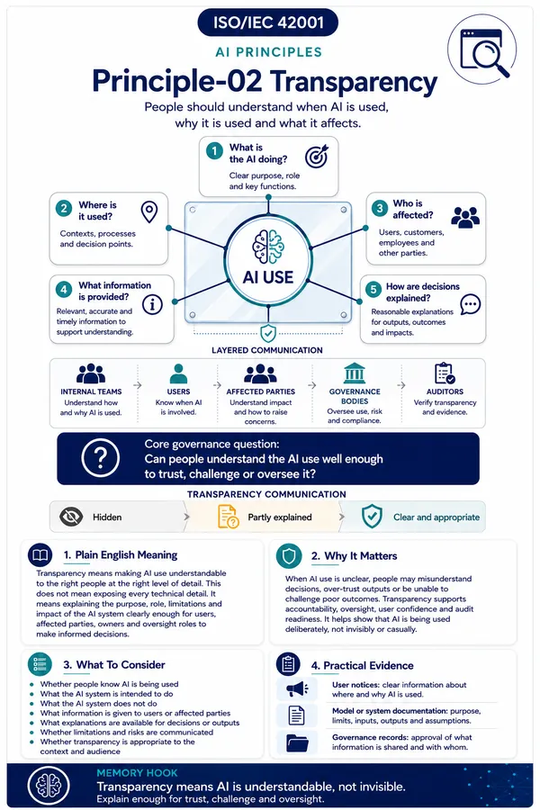</a></td>
    </tr>
    <tr>
      <td width="45%"><strong>Principle-03</strong><br>Accountability<br><a href="cards/ai-principles/reference/iso-42001-ai-principles-principle-03-accountability.md">Reference ↗</a> · <a href="cards/ai-principles/funny/iso-42001-ai-principles-principle-03-accountability-humorous-infographic.png">Humorous version ↗</a><br><br><sub>Accountability means clear lines of responsibility exist for AI systems and their outcomes. Organisations should be able to identify who is responsible for each AI system at every lifecycle stage, from design and deployment through to decommissioning. Responsibility rests with identifiable people and organisations, never with the system itself. This principle underpins the governance structure of an AIMS, and it is what makes traceability from an outcome back to the decision that caused it possible at all.</sub></td>
      <td width="55%"><a href="cards/ai-principles/professional/iso-42001-ai-principles-principle-03-accountability-professional-infographic.png"></a></td>
    </tr>
    <tr>
      <td width="45%"><strong>Principle-04</strong><br>Human Oversight<br><a href="cards/ai-principles/reference/iso-42001-ai-principles-principle-04-human-oversight.md">Reference ↗</a> · <a href="cards/ai-principles/funny/iso-42001-ai-principles-principle-04-human-oversight-humorous-infographic.png">Humorous version ↗</a><br><br><sub>Human oversight means people retain meaningful control over AI systems and the decisions they influence. Organisations should design systems so humans can intervene, correct or override outputs, particularly in high-stakes contexts. The word that carries the weight is "meaningful": oversight is not satisfied by a nominal reviewer who lacks the authority, information or time to actually intervene. This principle keeps AI systems as tools that support human judgement rather than quietly replacing it.</sub></td>
      <td width="55%"><a href="cards/ai-principles/professional/iso-42001-ai-principles-principle-04-human-oversight-professional-infographic.png">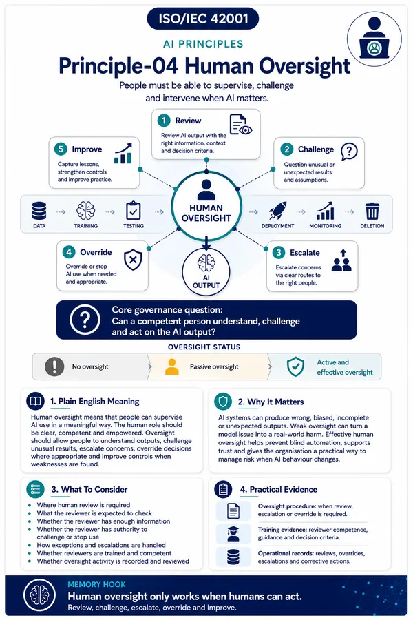</a></td>
    </tr>
    <tr>
      <td width="45%"><strong>Principle-05</strong><br>Privacy<br><a href="cards/ai-principles/reference/iso-42001-ai-principles-principle-05-privacy.md">Reference ↗</a> · <a href="cards/ai-principles/funny/iso-42001-ai-principles-principle-05-privacy-humorous-infographic.png">Humorous version ↗</a><br><br><sub>Privacy in AI means protecting personal data throughout the AI lifecycle, from collection and model training through to deployment and decommissioning. Organisations should apply data minimisation, purpose limitation and appropriate safeguards wherever personal data is used. AI introduces privacy risks beyond conventional data processing: models can re-identify individuals from supposedly anonymous data, infer sensitive attributes that were never collected, and memorise training examples that can later be extracted from their outputs.</sub></td>
      <td width="55%"><a href="cards/ai-principles/professional/iso-42001-ai-principles-principle-05-privacy-professional-infographic.png">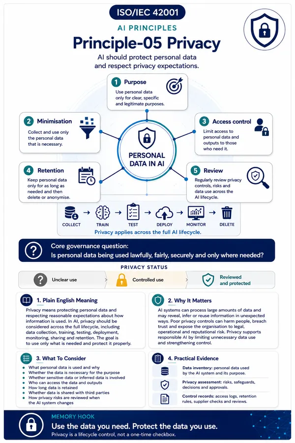</a></td>
    </tr>
    <tr>
      <td width="45%"><strong>Principle-06</strong><br>Safety and Reliability<br><a href="cards/ai-principles/reference/iso-42001-ai-principles-principle-06-safety-and-reliability.md">Reference ↗</a> · <a href="cards/ai-principles/funny/iso-42001-ai-principles-principle-06-safety-and-reliability-humorous-infographic.png">Humorous version ↗</a><br><br><sub>Safety and reliability mean AI systems should perform as intended, remain stable under varied conditions, and not cause unintended harm. Organisations should test systems thoroughly, monitor their behaviour in production, and have processes ready for when systems fail or behave unexpectedly. Reliability includes degrading predictably rather than failing silently, and detecting drift as real-world conditions diverge from training conditions. A system that cannot be relied upon cannot be responsibly deployed.</sub></td>
      <td width="55%"><a href="cards/ai-principles/professional/iso-42001-ai-principles-principle-06-safety-and-reliability-professional-infographic.png">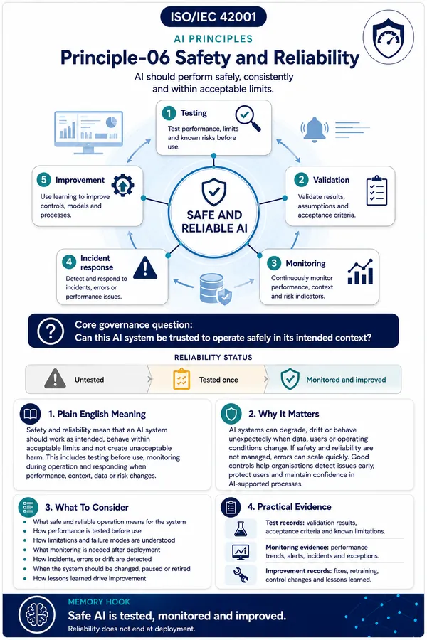</a></td>
    </tr>
  </tbody>
</table>

AI principles cards covering the core responsible AI concepts that underpin ISO/IEC 42001:2023 governance: fairness, transparency, accountability, human oversight, privacy, and safety and reliability.

---

### ISO 42001 Additional Variants

These are earlier infographic cards that have since been superseded by the current card designs, but the content remains accurate. Feel free to use any of these if you prefer the format.

Browse them in [`cards/archive/`](cards/archive/) or in the [online gallery](https://nelsambrose.github.io/ISO-42001-Visual-Library/#archive). They include an all-in-one "manage AI like a boss" overview, earlier designs for Clauses 5, 7, 8, 9 and 10, and earlier versions of the Annex A Operation domain, A.5 and A.10 cards.

## Community Recognition

This repository has been included in the following curated AI governance and responsible AI resource lists:

- [Awesome Artificial Intelligence Regulation](https://github.com/ethicalml/awesome-artificial-intelligence-regulation) - Curated resources focused on AI governance, regulation, and responsible AI.

- [Awesome Responsible AI](https://github.com/AthenaCore/AwesomeResponsibleAI) - Curated responsible AI tools, frameworks, standards, and learning resources.

- [Awesome EU AI Act](https://github.com/GenAI-Gurus/awesome-eu-ai-act) - Curated resources focused on the EU AI Act, AI governance, compliance, and responsible AI.

## Licence

This work is released under the MIT Licence. See [LICENSE.md](LICENSE.md) for the full terms.

You are free to use, copy, modify, and distribute these cards for any purpose, personal or commercial. Attribution is not required, but is always appreciated:

```text
ISO 42001 Visual Library by Nelson Ambrose — https://github.com/nelsambrose/ISO-42001-Visual-Library
```

Creator: [Nelson Ambrose](https://www.linkedin.com/in/nelson-ambrose/)

If you find these useful, please leave a ⭐

## Disclaimer

This repository is an independent learning resource. It is not affiliated with, endorsed by, or certified by ISO, IEC, or any certification body.

The materials are intended as learning aids and should not be treated as a replacement for the official ISO/IEC 42001:2023 standard, legal advice, audit advice, or certification guidance.

## About the Author

A personal visual overview of the author's AI governance focus and role in building the library.

[View the author overview card ↗](cards/about/iso-42001-visual-library-author-overview.png)
